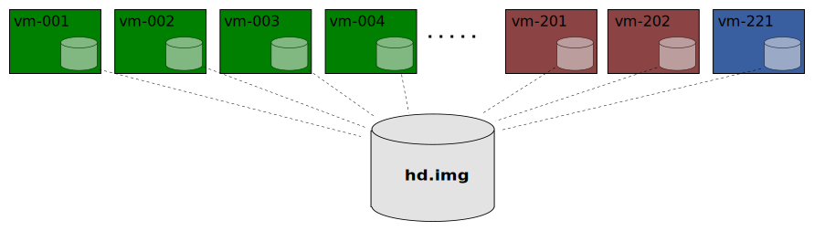
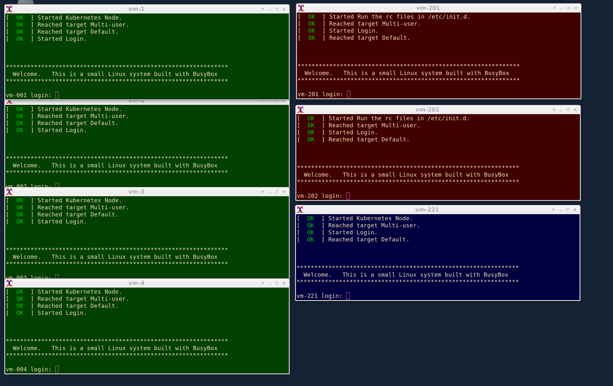

# Xcluster - Experimental Cluster Environment

A very lightweight and configurable cluster environment primarily
intended for development and test of network functions.

To see how `xcluster` can be used with
[Kubernetes](https://kubernetes.io/) please see the [Quick
Start](#quick-start) section or the Kubernetes
[overlay](ovl/kubernetes/README.md).

More info;

 * [Quick Start](#quick-start)
 * [Networking](doc/networking.md). Default network setup.
 * [Network name space](doc/netns.md). Setup a netns for running `xcluster` and DNS
 * [Overlays](doc/overlays.md). How they work and how they are created
 * [Overlay index](ovl-index.md)
 * [Disk-image and kernel](doc/image.md). How they are created and extended.
 * [Build from scratch](doc/build.md). If the binary release can't be used.
 * [Xcluster for CI](doc/ci.md). Headless operation.
 * [Pre-pulled images](ovl/images/README.md).

An `xcluster` consists of a number of identical (kvm) VMs. The disk
image is shared among the VMs and the `qemu-img` "backing_file"
function is used to allow individual writes (much like a layered
file-system);



The VMs are given "roles" depending on their hostname;

```
vm-001 - vm-200   Cluster nodes
vm-201 - vm-220   Router VMs
vm-221 - vm-240   Tester VMs
vm-250 -          Reserved
```

By default `xcluster` starts with consoles in `xterm` windows;



#### Overlays

In the earliest stage of start all VMs are mounting an iso image
(cdrom) that may contain any number of tar-files called
"overlays". The files are unpacked on root "/" in sort order and
provides a primitive packaging system. The iso image is created from
ovl directories. Example;

```
# Start an xcluster with overlays (xc is an alias for the xcluster.sh script)
xc mkcdrom systemd etcd; xc start
```

**Note** the "normal" way to add sw it to create an overlay, include it in
`xc mkcdrom` and re-start. Since re-start is so fast it is slower and
clumsier to copy sw to running VMs, e.g. with `ssh`.
[read more](doc/overlays.md).


### Execution environment and dependencies

`Xcluster` is developed on `Ubuntu 18.04.1 LTS`. It seems to work fine
also on Ubuntu 16.04 LTS but it will probably not work on other
distributions (mainly due to variations in libs). If you run on
another distribution than Ubuntu 18.04 you *may* run into problems
with pre-built images and cached overlays from the binary release when
you add own programs (because of library version probems). In that
case there may be no other option than to rebuild all images and
overlays locally [from scratch](doc/build.md).

Some additional packets may have to be installed. Below is a
suggestion, there may be others;

```
apt install -y jq net-tools libelf-dev pkg-config libmnl-dev \
 libdb-dev docbook-utils libpopt-dev gperf libcap-dev libgcrypt20-dev \
 libgpgme-dev libglib2.0-dev gawk libreadline-dev libc-ares-dev xterm \
 qemu-kvm curl pxz bison flex libc6:i386 uuid libgmp-dev libncurses-dev \
 screen
apt-add-repository -y ppa:projectatomic/ppa
apt update
apt install -y skopeo
```

You must be a member of the `kvm` group to be able to run VMs;

```
sudo usermod -aG kvm <your-user>
```

#### Environment and default options

Options to the `xcluster` functions can be specified on the command
line as "long options" for instance `--nrouters=2` or as an
environment variable;

```
xc start --nrouter=2
# same as;
__nrouters=2 xc start
# same as;
export __nrouters=2
xc start
```

This makes it very easy to set default options. The current
environment settings and default options can be printed with;

```
xc env
# If you need to use the settings in a script do;
eval $($XCLUSTER env)
```

#### Timezone

The timezone in the VMs is set (by you) using the
[timezone overlay](ovl/timezone/README.md).


#### The $ARCHIVE variable

`Xcluster` uses the $ARCHIVE directory to store for instance
downloaded archives. It defaults to `$HOME/Downloads` but you might
want something better.


<a name="quick-start">

## Quick start

Download from the release page and install;

```
ver=v0.4
cd $HOME
tar xf Downloads/xcluster-$ver.tar.xz
cd xcluster
. ./Envsettings
```

Start an empty cluster. Xterms shall pop-up like in the screenshot
above. You can login to a vm using `vm`;

```
xc start
# If the windows closes immediately, to troubleshoot do;
xtermopt=-hold xc start --nrouters=0 --nvm=2
```

This is the base `xcluster`. All VMs are connected to the "internal"
network and are reachable with `ssh` or `telnet`. Experiment some and
then stop the ckuster;

```
vm 1          # "vm" is a shell function that opens an xterm on the vm
ssh root@localhost -p 12101   # Qemu port forwarding is used
xc stop
```

### Xcluster with Kubernetes

```
cd $HOME/xcluster
. ./Envsettings.k8s
xc start
```


Open a terminal on a node with `vm`;

```
vm 4
# On the cluster node;
kubectl version
kubectl get nodes
images  # alias that lists the pre-pulled images
```

The [mconnect](https://github.com/Nordix/mconnect) image can be used
for basic connectivity tests;

```
kubectl apply -f /etc/kubernetes/mconnect.yaml
kubectl get pods
kubectl get svc
mconnect -address mconnect.default.svc.xcluster:5001 -nconn 400
```

#### Kubernetes ipv6-only

```
SETUP=ipv6 xc mkcdrom etcd k8s-config externalip; xc start
vm 1
# On the cluster node;
kubectl get nodes -o wide
kubectl apply -f /etc/kubernetes/mconnect.yaml
kubectl get svc
```

As you can see the `mconnect` service has an external ip
`1000::2`. Test to access it from a router VM;

```
vm 201
# On the router vm;
mconnect -address [1000::2]:5001 -nconn 400
```
