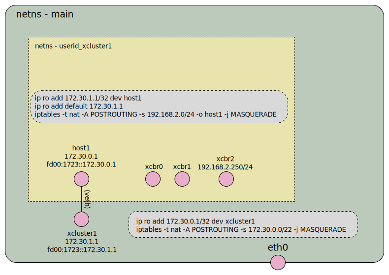

# Network name-space for xcluster

`Xcluster` is intended for development and testing of network
functions. As such it alter the network configuration for instance
create bridges and tap devices, defined new ip subnets, add rules to
iptables, etc. In most Linux distributions the main netns is governed
by some programs such as the `NetworkManager` and `firewalld`. There
is a risk that `xcluster` does things that conflicts with the
management program or that the management program interfere with the
`xcluster` setup.

If a `netns` is used the networking is done with bridge/tap devices
which is *much* faster than user-space networking and closer to the
real thing. For this reason `xcluster` should execute in it's own
netns for more advanced network testing. To setup do;

```
sudo setcap cap_net_admin,cap_sys_admin+ep /bin/ip   # (once)
# On Ubuntu >=20 setcap does not work, instead;
sudo chmod a+s /bin/ip
xc nsadd 1          # Requires "sudo"
# Or
xc nsadd_docker 1   # This steals a docker container address
xc nsenter 1
. ./Envsettings
. ./Envsettings.k8s
```

The `xc nsadd_docker <index>` does not start any Docker container, but
it "steals" a Docker container address and use it for the `xcluster`
netns. *There might be conflicts!*. No checks are made so be
observant. However this uses the Docker network which is probably left
alone by the NetworkManager and firewalls.



Routing and masquerade is setup so the host network (and internet) is
reachable from the netns. Also traffic from the ["External
net"](networking.md) in the xcluster is masqueraded to allow the nodes
in the xcluster to access the internet via the router VMs.

### Setcap on Ubuntu 20

`setcap` does not work in Ubuntu 20. This has been reported but will
not be fixed; https://bugs.launchpad.net/ubuntu/eoan/+source/iproute2/+bug/1856045

