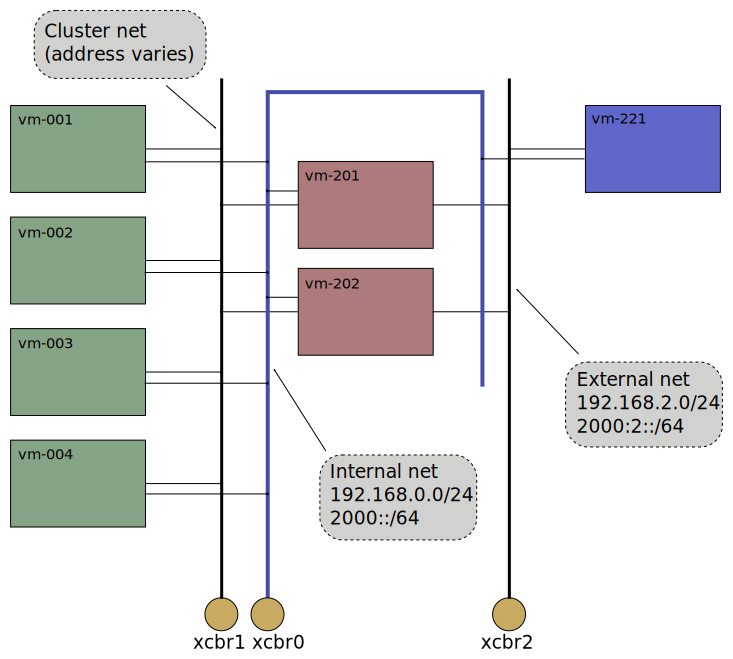
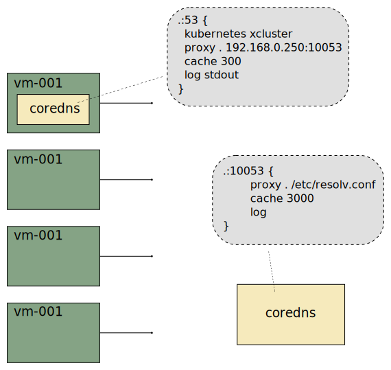

# Xcluster networking

The `xcluster` networking uses 2 setups;

* User-space networking. This is used when `xcluster` is executed in
  main netns. It does not require root or sudo or any network
  preparations.

* Linux bridges and tap devices. This is used when `xcluster` is
  executed in it's own netns. This requires a network setup using
  sudo/root which is done with `xc nsadd`. Execution requires that the
  `ip` program can run as non-root (using "setcap" or suid). This setup is
  much faster and closer to the real thing than user-space networking.

The default network has 3 nets. The image shows the bridges;



 * Maintenance net - Intended mainly for control functions. All VMs shall
   be reachable via this network.  The `vm` function for open a
   terminal to a VM does a `telnet` on this net.

 * Cluster net - This is the main cluster network. It is connected to
   cluster nodes for cluster signalling and to the routers for
   external connectivity. The addresses varies depending on the
   cluster setup.

 * External net - This represents the outside world, like the
   "internet".

The base image only setup the Internal net on the VMs. The other
networks are configured by overlays please see
[ovl/network-topology](../ovl/network-topology/).

The addresses are assigned from the hostname of the VM. The last digit
in the address is the number from the hostname, e.g. 1 for
"vm-001". For now the hostname number is taken from the lsb of the MAC
address on the interface towards the Internal net (eth0). This may
however change for instance if the MAC addresses can't be controlled.

With user-space networking the internal net is a qemu [user
network](https://wiki.qemu.org/Documentation/Networking#User_Networking_.28SLIRP.29).
It allows connectivity with the host but does not support traffic
between VMs. So for instance you can't reach vm-002 from vm-001 using
the `192.168.0.2` address. The other nets are qemu "socket" networks
(UML/multicast) they provide connectivity between VMs but can not be
used for connectivity with the host.


## DNS

A `coredns` is started outside the xcluster on port `10053`. A
`coredns` (shown as k8s in the figure) on the cluster is setup that
proxies to the outside dns;



A `coredns` binary is bundled in the `xcluster` binary release and is
used unless a `$GOPATH/bin/coredns` exists. In Linux (in the clib to
be precise) you can not tell the resolver to use any other port than
the standard `53` so a dns server on the cluster is needed even if k8s
is not used so they are started on the routers and tester VMs.

If you are using a [netns](netns.md) for `xcluster` you must ensure
that your Linux system does not setup a local dns;

```
# (On your host, NOT in a VM;)
$ cat /etc/resolv.conf 
...
nameserver 127.0.1.1
```

If you see a local address as nameserver you must disable it. Follow
[these](https://askubuntu.com/questions/907246/how-to-disable-systemd-resolved-in-ubuntu)
instructions.

Note if you are using `xcluster` i main netns with user-space
networking the local dns is perfectly fine.


### DNS trouble shooting

DNS problems are unfortunately quite common.

#### In main netns

First make sure the CoreDNS is running and serve requests on port
10053;

```
netstat -lputan | grep :::10053
tcp6       0      0 :::10053                :::*                    LISTEN      3457/coredns
udp6       0      0 :::10053                :::*                                3457/coredns
```

The `coredns` is started by the `Envsettings.k8s` script. Make sure it
is sourced and check the coredns start in the script.

Now test that the local coredns can serve DNS requests;

```
dig -4 @127.0.0.1 -t A -p 10053 www.google.se
dig -6 @::1 -t AAAA -p 10053 www.google.se
```

If this does not work check your local (normal) DNS setup.

Now try DNS lookups from within `xcluster` directly to the server
running on the host;

```
xc mkcdrom iptools; xc starts
# On some vm;
nslookup www.google.se 192.168.0.250:10053
nslookup www.google.se [1000::1:192.168.0.250]:10053
```

Now try the local coredns;

```
nslookup www.google.se
nslookup kubernetes.default.svc.xcluster
```

If the direct access works but not when the k8s coredns is used there
is likely some problem with the `xcluster` setup.

Finally you can verify that DNS lookups works from within a pod.

```
kubectl apply -f /etc/kubernetes/alpine.yaml
kubectl get pods
kubectl exec -it alpine-deployment-... -- sh
# In the pod;
nslookup www.google.se
nslookup kubernetes.default.svc.xcluster
```

#### In netns

First check that nslookup works in the own `netns`;

```
nslookup www.google.se
```

If this does not work first check `/etc/resolv.conf` for any localhost
addresss as described above. If the `/etc/resolv.conf` contains ip
addresses for nameservers (as it should) you should be able to `ping`
those addresses. If that does not work you must check the NAT rule in
the **main** netns;

```
> sudo iptables -t nat -L POSTROUTING -nv
...
  492 33386 MASQUERADE  all  --  *      *       172.30.0.0/22        0.0.0.0/0
```

There must be a NAT rule for the netns address. This should be setup
by the `xc nsadd 1` command.

When nslookup works in the netns continue with the same tests as in
main netns as described above. The local CoreDNS should work, etc.

There is also a NAT rule **inside** the netns that has to be in place;

```
> sudo iptables -t nat -L POSTROUTING -nv
  178 10680 MASQUERADE  all  --  *      host1   192.168.0.0/24       0.0.0.0/0
```

This enables access to external addresses from within xcluster VMs via eth0.


## Customizing

If the network topology is ok but you want to use something else than
the default bridge/tap networking, for instance
[ovs](https://www.openvswitch.org/), then you can secify a script with
the `__net_setup` variable. The script will be called for each vm
like;

```
$__net_setup <node> <net>
# Example; $__net_setup 3 1
```

Your script must do necessary configuration and print out options to
`kvm`. See the
[net-setup-userspace.sh](../config/net-setup-userspace.sh) script for
an example.

If you need more networks use `--nets-vm` and `--nets_router`
options. Please see
[ovl/network-topology](../ovl/network-topology/README.md) for
examples.


### Full custom

To completely alter the network setup you must create you own
start-function in the `xcluster.sh` script. You should not edit the
script but use a "hook";

```
export XCLUSTER_HOOK=$MY_EXPERIMENT_DIR/xcluster.hook
xc mystart
```

Copy `cmd_start()` to your hook and modify it to your needs.

