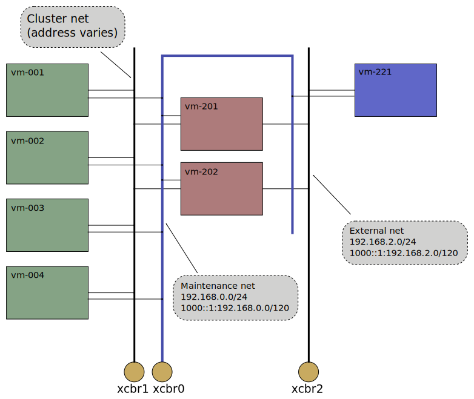

# Xcluster networking

The `xcluster` networkin uses 2 setups;

* User-space networking. This is used when `xcluster` is executed in
  main netns. It does not require root or sudo or any network
  preparations.

* Linux bridges and tap devices. This is used when `xcluster` is
  executed in it's own netns. This requires a network setup using
  sudo/root which is done with `xc nsadd`. Execution requires that the
  `ip` program can run as non-root (using "setcap"). This setup is
  much faster and closer to the real thing than user-space networking.

The default network has 3 nets. The image shows the bridges;



 * Internal net - Intended mainly for control functions. All VMs shall
   be reachable via this network.  The `vm` function for open a
   terminal to a VM does a `telnet` on this net.

 * Cluster net - This is the main cluster network. It is connected to
   cluster nodes for cluster signalling and to the routers for
   external connectivity. The addresses varies depending on the
   cluster setup.

 * External net - This represents the outside world, like the
   "internet".

The base image only setup the Internal net on the VMs. The other
networks are configured by overlays.

The addresses are assigned from the hostname of the VM. The last digit
in the address is the number from the hostname, e.g. 1 for
"vm-001". For now the hostname number is taken from the lsb of the MAC
address on the interface towards the Internal net (eth0). This may
however change for instance if the MAC addresses can't be controlled.

With user-space networking the internal net is a qemu "user"
network. It allows connectivity with the host but does not support
traffic between VMs. So for instance you can't reach vm-002 from vm-001
using the `192.168.0.2` address. The other nets are qemu "socket"
networks (UML/multicast) they provide connectivity between VMs but can
not be used for connectivity with the host.


## Customizing

To alter the network setup, for instance adding another network, you
must create you own start-function in the `xcluster.sh` script. You
should not edit the script but use a "hook";

```
export XCLUSTER_HOOK=$MY_EXPERIMENT_DIR/xcluster.hook
xc mystart
```

Copy `cmd_start()` to your hook and modify it to your needs.

### Alternative network

If the network topology is ok but you want to use something else than
the default bridge/tap networking, for instance
[ovs](https://www.openvswitch.org/) then you can secify a script with
the `__net_setup` variable. The script will be called for each vm
like;

```
$__net_setup <node> <net>
# Example; $__net_setup 3 1
```

Your script must do necessary configuration and print out options to
`kvm`. See the
[net-setup-userspace.sh](../config/net-setup-userspace.sh) script for
an example.


