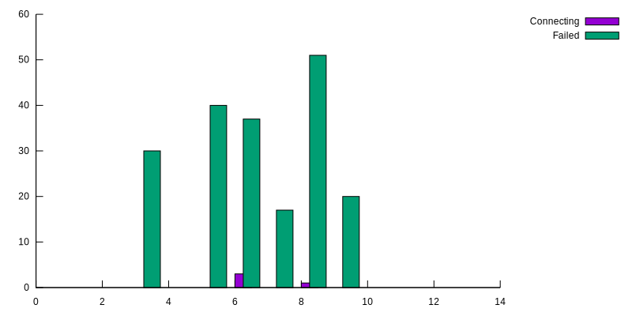

# Xcluster ovl - ctraffic

Adds the [ctraffic](https://github.com/Nordix/ctraffic) continuous
traffic test program.

## Usage

Basic usage;
```
xc mkcdrom private-reg externalip ctraffic; xc starts
# On a router;
kubectl apply -f /etc/kubernetes/ctraffic-extip.yaml
ctraffic -address 10.0.0.2:5003 -nconn 400 -rate 100 -monitor | jq .
```

With loadBalancerIP;
```
xc mkcdrom private-reg metallb gobgp ctraffic; xc starts
# On cluster;
kubectl apply -f https://raw.githubusercontent.com/google/metallb/v0.7.3/manifests/metallb.yaml
kubectl apply -f /etc/kubernetes/metallb-config.yaml
kubectl get pods -n metallb-system
kubectl apply -f https://github.com/Nordix/ctraffic/raw/master/ctraffic.yaml
# On a router;
ctraffic -address 10.0.0.0:5003 -nconn 400 -rate 100 -monitor_interval 1s | jq .
```

Copy the image to the private registry;
```
ver=0.1      # (or whatever...)
skopeo copy --dest-tls-verify=false \
  docker-daemon:nordixorg/ctraffic:$ver \
  docker://172.17.0.2:5000/nordixorg/ctraffic:$ver
skopeo delete --tls-verify=false docker://172.17.0.2:5000/nordixorg/ctraffic:$oldver
```

## ECMP test

Remove and re-add an ECMP target and investigate the impact on
traffic.

```
xc mkcdrom private-reg externalip ctraffic; xc starts
# On cluster;
kubectl apply -f /etc/kubernetes/ctraffic-extip.yaml
kubectl get pods   # Check that the ctraffic are Running
# On a router;
ctraffic -timeout 30s -address 10.0.0.2:5003 -nconn 400 -rate 400 -monitor | jq .
# On the same router but in another terminal;
ip route change 10.0.0.0/24 \
  nexthop via 192.168.1.2 \
  nexthop via 192.168.1.3 \
  nexthop via 192.168.1.4
# Watch the monitoring printouts, ~200 connections lost;
ip route change 10.0.0.0/24 \
  nexthop via 192.168.1.1 \
  nexthop via 192.168.1.2 \
  nexthop via 192.168.1.3 \
  nexthop via 192.168.1.4
# Watch the monitoring printouts, another ~100 connections lost;
```

Some manual experimenting gives that ~200 connections are lost when
one (of 4) ECMP target is removed. When the ECMP target is re-added
another ~100 connections are lost. This is less than expected so it
implies that Linux uses
[consitent hashing](https://en.wikipedia.org/wiki/Consistent_hashing).


## Drop test

Iptables is used to simulate a shaky network;

```
xc mkcdrom private-reg externalip ctraffic; xc starts
# On a router;
kubectl apply -f /etc/kubernetes/ctraffic-extip.yaml
kubectl get pods   # Check that the ctraffic are Running
ctraffic -timeout 30s -address 10.0.0.2:5003 -nconn 40 -rate 500 -monitor \
  -stats=all > /tmp/packet-loss.json
# In another terminal
iptables -A INPUT -i eth1 -m statistic --mode random --probability 0.05 -j DROP
iptables -D INPUT 1
```

Note that the `dropped` packets increase. This is because when it is
time to sent the next packet with the specified rate the reply has not
been received yet due to retransmits.


## Rolling upgrade test

The `ctraffic` server is upgraded with [rolling
update](https://kubernetes.io/docs/concepts/workloads/controllers/deployment/#updating-a-deployment).

In this test a [private docker registry](../private-reg/) *must* be
used. Start by copying the existing `ctraffic` image to the private
registry but with a new tag;

```
skopeo copy --dest-tls-verify=false docker-daemon:nordixorg/ctraffic:v0.2 docker://172.17.0.2:5000/nordixorg/ctraffic:v99.0
```

The "strategy" is configured like this;

```
  strategy:
    rollingUpdate:
      maxSurge: 0%
      maxUnavailable: 25%
    type: RollingUpdate
```

Since we have 4 replicas the pods are upgraded 1-at-the-time. An
analyze of 120 connections are lost and reconnected may look like
this;

```
  R1  R2  R3  R4 Lost
  30  30  30  30    0
   0  40  40  40   30
  13   0  54  53   40
  31  18   0  71   54
  54  42  24   0   71
                  195 Total
```

To test we start `ctraffic` and perform an upgrade. It is also
interresting to monitor the replica-sets with `kubectl get rs` during
the upgrade;

```
xc mkcdrom private-reg externalip ctraffic; xc starts
# On a router;
kubectl apply -f /etc/kubernetes/ctraffic-extip.yaml
kubectl get pods   # Check that the ctraffic are Running
ctraffic -timeout 15s -address 10.0.0.2:5003 -nconn 120 -rate 500 -monitor \
  -stats=all > /tmp/upgrade.json

# On the cluster;
vi /etc/kubernetes/ctraffic-extip.yaml  # image -> v99.0
kubectl apply -f /etc/kubernetes/ctraffic-extip.yaml

# In another shell
watch kubectl get rs
```

After the tast has concluded "rcp" the `/tmp/upgrade.json` to your
host and create a graph with;

```
$GOPATH/src/github.com/Nordix/ctraffic/scripts/plot.sh \
  connections --terminal=qt --stats=/tmp/upgrade.json
```

Here is an example graph;



It conforms almost too good with the analyze above.
