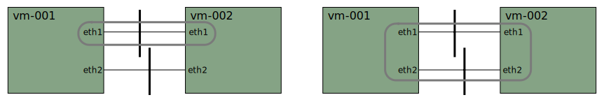

# Xcluster/ovl - dpdk

Run DPDK in xcluster.

## Links

May or may not be useful, in no particular order;

* https://doc.dpdk.org/guides/nics/virtio.html
* https://wiki.qemu.org/Features/VirtioVhostUser
* https://doc.dpdk.org/guides-2.0/sample_app_ug/vhost.html
* https://www.redhat.com/en/blog/hands-vhost-user-warm-welcome-dpdk
* https://doc.dpdk.org/guides/prog_guide/kernel_nic_interface.html#kni
* https://doc.dpdk.org/guides/tools/devbind.html
* https://doc.dpdk.org/guides/linux_gsg/sys_reqs.html
* https://dpdk-guide.gitlab.io/dpdk-guide/setup/binding.html CONFIG_VFIO_NOIOMMU=y
* https://doc.dpdk.org/guides/sample_app_ug/l2_forward_real_virtual.html


## Usage

A dpdk built for an xcluster kernel must be used. This is described in
the "Build" chapter below. But for basic experiments user a pre-packed
ovl/dpdk can be downloaded to the xcluster cache.

Prepare;
```
cdo dpdk
. ./Envsettings
./dpdk.sh download_cache
# Or build the kernel and DPDK locally as described below
```

Basic test;
```
#sudo apt install -y hugeadm # (if needed)
#sudo apt install -y libhugetlbfs-bin
cdo dpdk
. ./Envsettings
./dpdk.sh test start_basic > $log
# On vm-001
dpdk-testpmd -l 0-1 -n 2 --vdev=eth_af_packet0,iface=eth1 -- \
  -i --total-num-mbufs=16384
```

### Traffic tests with dpdk-testpmd

The `dpdk-testpmd` is used to verify that DPDK works. Two traffic
cases are tested;



First we test traffic that is just looped over the same interface.

```
# On vm-001;
dpdk-testpmd -l 0-1 -n 2 \
 --vdev=eth_af_packet0,iface=eth1 -- \
 -i --total-num-mbufs=16384 --eth-peer=0,00:00:00:01:01:02
set fwd macswap
start
# On vm-002;
dpdk-testpmd -l 0-1 -n 2 \
 --vdev=eth_af_packet0,iface=eth1 -- \
 -i --total-num-mbufs=16384 --eth-peer=0,00:00:00:01:01:01
set fwd macswap
start tx_first
# Wait a while, then do "stop" in both testpmd's and check statistics
```

In the second case traffic is forwarded between two interfaces.

```
# On vm-001;
dpdk-testpmd -l 0-1 -n 2 \
 --vdev=eth_af_packet0,iface=eth1 --vdev=eth_af_packet1,iface=eth2 -- \
 -i --total-num-mbufs=16384 --eth-peer=0,00:00:00:01:01:02 --eth-peer=1,00:00:00:01:02:02
set fwd mac
start
# On vm-002;
dpdk-testpmd -l 0-1 -n 2 \
 --vdev=eth_af_packet0,iface=eth1 --vdev=eth_af_packet1,iface=eth2 -- \
 -i --total-num-mbufs=16384 --eth-peer=0,00:00:00:01:01:01 --eth-peer=1,00:00:00:01:02:01
set fwd mac
start tx_first
# Wait a while, then do "stop" in both testpmd's and check statistics
```

## Build dpdk

The latest LTS (Long Term Stable) version is used, at the moment 20.11;

```
cdo dpdk
. ./Envsettings
./dpdk.sh env | grep -E 'dpdk_ver|kver'
__dpdk_ver='20.11'
```

To build dpdk a locally built kernel must be used;

```
cdo dpdk
. ./Envsettings
eval $($XCLUSTER env | grep __kver)
curl -L https://mirrors.edge.kernel.org/pub/linux/kernel/v5.x/$__kver.tar.xz > $ARCHIVE/$__kver.tar.xz
mkdir -p $HOME/bin $HOME/tmp/linux
xc kernel_build
```

Kernel configs to check (already set in xcluster);
```
> Device Drivers > Userspace I/O drivers > Generic driver...
> Device Drivers > PCI support > Message Signaled Interrupts (MSI and MSI-X)
```

Dpdk build uses meson/ninja so these tools may have to be
installed. Then build;

```
#sudo apt install -y meson  # Too old!
./dpdk.sh install_meson
./dpdk.sh download
./dpdk.sh unpack
./dpdk.sh build
# Installed in $__dpdk_src/build/sys
# sudo apt remove libdpdk-dev  # To avoid using a Ubuntu dpdk by mistake
```

### Build older dpdk versions

DPDK is kernel dependent so an older kernel must be used. The build
system for DPDK is changed from "make" to "meson/ninja" in 19.11.x
which supports both. 20.11 has only support for "meson/ninja" and
17.11.x has only support for "make".

19.11.x;
```
cdo dpdk
export __dpdk_ver=19.11.5
export __kver=linux-5.8.1
. ./Envsettings
# Download and build the kernel if necessary
./dpdk.sh download
./dpdk.sh unpack
./dpdk.sh build
```

17.11.x;
```
cdo dpdk
export __dpdk_ver=17.11.10
export __kver=linux-5.4.35
. ./Envsettings
# Download and build the kernel if necessary
./dpdk.sh download
./dpdk.sh unpack
./dpdk.sh make  # Not "build"!
# Installed in $__dpdk_src/sys  (different from build!)
```

Remember to remove the cached ovl/dpdk if you want to use your local build.

```
xc cache --list
rm ...
```


## Build own applications

Prerequisite; DPDK is built locally.

As mentioned the DPDK build system has changed in 19.11.x. We start
with the newer.

To build a DPDK application set compile and link flags with
`pkg-config`.

```
pkg-config --cflags libdpdk
pkg-config --libs libdpdk
pkg-config --static --libs libdpdk
```

A generic Makefile is provided that can be used to build applications
contained in one directly like the dpdk examples.

```
make -j$(nproc) -f src/Makefile DIR=$__dpdk_src/examples/l3fwd DST=/tmp
ls -l /tmp/l3fwd
```

You must copy the dpdk lib's that your application uses to your
xcluster ovl;

```
./dpdk.sh libs /tmp/l3fwd
```

### Build older applications

Many DPDK applications uses the old build system. Here the
[glb-director](https://github.com/github/glb-director) is taken as an
example.

Prerequisite; DPDK 17.11.10 is built locally and used.

```bash
# Clone the glb-director and cd to <src-dir>/src/glb-director
export RTE_SDK=$__dpdk_src/sys/share/dpdk
eval $($XCLUSTER env | grep __kobj)
export RTE_KERNELDIR=$__kobj
#sed -i -e 's,9220,2220,' -e 's,8192 \* 8,8192 \* 2,' config.h
make -j$(nproc) RTE_TARGET=x86_64-native-linuxapp-gcc
cd cli
make glb-director-cli
```

(the `sed` reduces memory requirement to fit into xcluster)


## Other info and commands

In no particular order;
```
lshw -class network -businfo
# json output is broken for "-class network"
lshw -json | jq '.children[0].children[]|select(.class == "bridge")|.children[]|select(.class == "network")'
modprobe uio
modprobe uio_pci_generic
echo uio_pci_generic > /sys/bus/pci/devices/0000:00:05.0/driver_override
hugeadm --explain
cat /proc/meminfo | grep Huge
sysctl vm.nr_hugepages
ls /dev/hugepages
```
