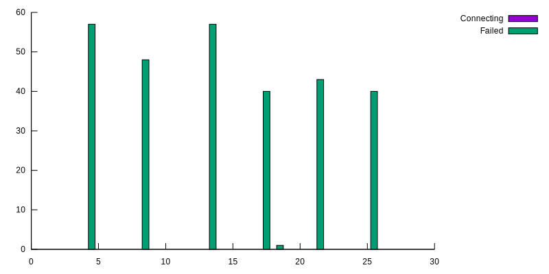

Xcluster overlay - ecmp
=======================

Demonstrates Equal Cost Multi Path
[ECMP](https://en.wikipedia.org/wiki/Equal-cost_multi-path_routing)
with a simple load balancer.


Some articles on the topic;

* https://codecave.cc/multipath-routing-in-linux-part-1.html
* https://codecave.cc/multipath-routing-in-linux-part-2.html
* https://codecave.cc/multipath-routing-ecmp-in-linux-part-3.html
* https://cumulusnetworks.com/blog/celebrating-ecmp-part-one/
* https://cumulusnetworks.com/blog/celebrating-ecmp-part-two/


Usage
-----

```
# Use the normal image (no k8s);
eval $($XCLUSTER env | grep XCLUSTER_HOME)
export __image=$XCLUSTER_HOME/hd.img
# Start;
xc mkcdrom xnet ecmp; xc start --ntesters=1
# On the tester;
mconnect -address [1000::2]:5001 -nconn 100
mconnect -address 10.0.0.2:5001 -nconn 100
ssh 1000::2
mconnect -address 10.0.0.2:5001 -nconn 100 -srccidr 222.222.222.0/24
mconnect -address [1000::2]:5001 -nconn 100 -srccidr 5000::/112
# On vm-201;
mconnect -address 10.0.0.2:5001 -nconn 100 -srccidr 222.222.233.0/24
mconnect -address [1000::2]:5001 -nconn 100 -srccidr 6000::/112
mconnect -address [1000::2]:5001 -nconn 100  # WILL NOT BE LOAD-BALANCED!
```

The tester is setup with additional sub-nets on the `lo` interface
that can be used as sources by
[mconnect](https://github.com/Nordix/mconnect#many-source-addresses).


### Continuous traffic

This measures the disturbance on ongoing connections if an ECMP target
is added or removed. The [ctraffic](https://github.com/Nordix/ctraffic)
test program is used.

```
unset XOVLS __mem1
export __mem=512
xc mkcdrom xnet ecmp; xc starts --nvm=10 --nrouters=1 --ntesters=1
# On vm-201
ecmp_test tcase_targets 10
# On vm-221 (tester)
ctraffic -address 10.0.0.2:5003 -nconn 100 -rate 500 -monitor \
  -timeout 20s -stats=all > /tmp/ctraffic4.json 
# On vm-201 while the test is running;
ecmp_test tcase_targets 9
# (wait a few sec...)
ecmp_test tcase_targets 10
```

Post-processing;
```
scp root@192.168.0.221:/tmp/ctraffic4.json /tmp
cd $GOPATH/src/github.com/Nordix/ctraffic
./scripts/plot.sh connections < /tmp/ctraffic4.json > /tmp/ctraffic4.svg
```

### Observations

It looks like ~50% of existing connections are lost whenever a ecmp
target is added or removed. This is very consistent and independent of
the number of targets. Example

```
./ecmp.sh test --no-stop > /dev/null
# On vm-221
ctraffic -address [1000::2]:5003 -nconn 100 -rate 500 -monitor \
  -timeout 30s -monitor -stats=all > /tmp/ctraffic6.json 
# On vm-201 whilce traffic is running;
ecmp_test tcase_targets 9
# wait and check the ctraffic monitor printouts
ecmp_test tcase_targets 8
# wait and check the ctraffic monitor printouts
...
```

In this run the number of ecmp targets are initially 10 and are
decreased one-by-one down to 4. Monitor printout;

```
# ctraffic -address [1000::2]:5003 -nconn 100 -rate 500 -monitor \
 -timeout 30s -monitor -stats=all > /tmp/ctraffic6.json
Conn act/fail/connecting: 100/0/0, Packets send/rec/dropped: 496/494/0
Conn act/fail/connecting: 100/0/0, Packets send/rec/dropped: 997/996/0
Conn act/fail/connecting: 100/0/0, Packets send/rec/dropped: 1497/1497/0
Conn act/fail/connecting: 100/0/0, Packets send/rec/dropped: 1997/1997/0
Conn act/fail/connecting: 100/57/0, Packets send/rec/dropped: 2516/2467/0
Conn act/fail/connecting: 100/57/0, Packets send/rec/dropped: 3021/2969/0
Conn act/fail/connecting: 100/57/0, Packets send/rec/dropped: 3523/3474/0
Conn act/fail/connecting: 100/57/0, Packets send/rec/dropped: 4023/3974/0
Conn act/fail/connecting: 100/105/0, Packets send/rec/dropped: 4536/4450/0
Conn act/fail/connecting: 100/105/0, Packets send/rec/dropped: 5039/4952/0
Conn act/fail/connecting: 100/105/0, Packets send/rec/dropped: 5542/5454/0
Conn act/fail/connecting: 100/105/0, Packets send/rec/dropped: 6042/5957/0
Conn act/fail/connecting: 100/105/0, Packets send/rec/dropped: 6543/6458/0
Conn act/fail/connecting: 100/162/0, Packets send/rec/dropped: 7057/6928/0
Conn act/fail/connecting: 100/162/0, Packets send/rec/dropped: 7558/7430/0
Conn act/fail/connecting: 100/162/0, Packets send/rec/dropped: 8061/7933/0
Conn act/fail/connecting: 100/162/0, Packets send/rec/dropped: 8561/8433/0
Conn act/fail/connecting: 100/203/0, Packets send/rec/dropped: 9079/8914/0
Conn act/fail/connecting: 100/203/0, Packets send/rec/dropped: 9580/9416/0
Conn act/fail/connecting: 100/203/0, Packets send/rec/dropped: 10082/9918/0
Conn act/fail/connecting: 100/203/0, Packets send/rec/dropped: 10584/10420/0
Conn act/fail/connecting: 100/246/0, Packets send/rec/dropped: 11093/10894/0
Conn act/fail/connecting: 100/246/0, Packets send/rec/dropped: 11593/11396/0
Conn act/fail/connecting: 100/246/0, Packets send/rec/dropped: 12097/11899/0
Conn act/fail/connecting: 100/246/0, Packets send/rec/dropped: 12598/12400/0
Conn act/fail/connecting: 100/286/0, Packets send/rec/dropped: 13110/12881/0
Conn act/fail/connecting: 100/286/0, Packets send/rec/dropped: 13615/13383/0
Conn act/fail/connecting: 100/286/0, Packets send/rec/dropped: 14116/13887/0
Conn act/fail/connecting: 100/286/0, Packets send/rec/dropped: 14616/14387/0
```

A plot of the lost connections looks like this;




## Run tests

```
./ecmp.sh test > /tmp/ecmp-test.log
# To leave the system running;
./ecmp.sh test --no-stop > /tmp/ecmp-test.log
```

The ipv6/ecmp/ssh bug
---------------------

This bug it fixed in kernel 4.18, but may be present in earlier
kernels.

```
> ssh -p 1022 root@1000::2 hostname
Warning: Permanently added '[1000::2]:1022' (ECDSA) to the list of known hosts.
packet_write_wait: Connection to 1000::2 port 1022: Broken pipe
```

Linux uses something they call `flowinfo` to compute the ecmp hash for
ipv6. This includes the `flowlabel` but also the DSCP bits. Ssh seem
to alter the DSCP in the middle of the session which disrupt the
`flow-based` ecmp.

To view this in action trace on a router, e.g. `vm-201`;

```
tcpdump -ni eth0 -w /tmp/ssh.pcap port 1022
```

Do a (failing) `ssh -p 1022 root@1000::2 hostname` and copy the pcap
file and use `wireshark`;

```
scp root@192.168.0.201:/tmp/ssh.pcap /tmp
wireshark /tmp/ssh.pcap &
```

