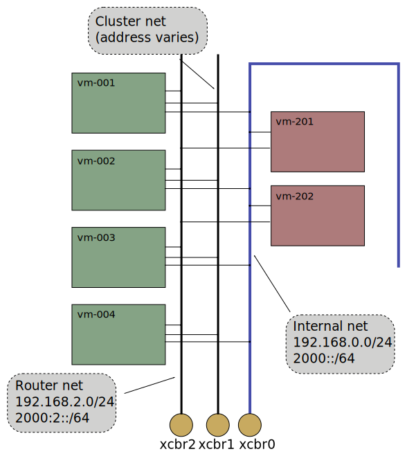

# Xcluster ovl - External net

Setup separate networks for cluster internal traffic (1) and external
traffic to routers (2).



## Usage

```
export __nets_vm=0,1,2
export __nets_router=0,2
xc mkcdrom externalip ext-net; xc start
# Or;
xc mkcdrom externalip ext-net; xc start --nets_vm=0,1,2 --nets_router=0,2
```

