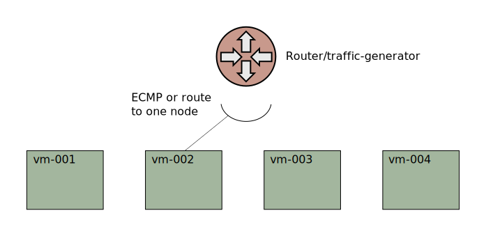
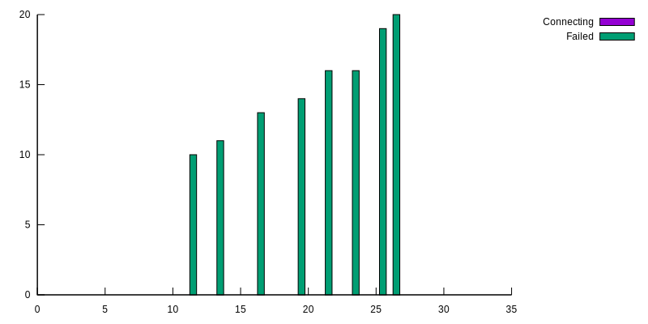
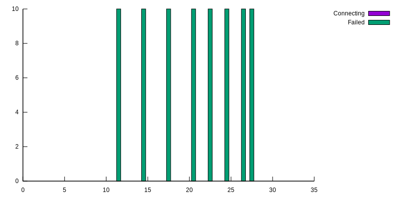

# Xcluster/ovl - k8s-app-upgrade

Test of application upgrade in Kubernetes. A Deplyment is upgraded
using [rolling upgrade](
https://kubernetes.io/docs/concepts/workloads/controllers/deployment/#updating-a-deployment),
[ctraffic]( https://github.com/Nordix/ctraffic) is used to show
traffic impact



The traffic-generator (TG) generates 400 pkt/S over 80 tcp connections
(5 pkt/S per connection). When a connection fails the TG immediately
tries to re-connect. A perfect score is if we lose 80 connection (to
the old pods) and re-connect succefully 80 times (to the updated pods).

The application is a Deployment with replicas=8, i.e. ~10 connections
per endpoint (pod).

```yaml
apiVersion: apps/v1
kind: Deployment
metadata:
  name: mserver
spec:
  replicas: 8
  selector:
    matchLabels:
      app: mserver
  strategy:
    type: RollingUpdate
    rollingUpdate:
      maxUnavailable: 0
      maxSurge: 1
  template:
    metadata:
      labels:
        app: mserver
    spec:
      #terminationGracePeriodSeconds: 4
      containers:
      - name: mserver
        image: registry.nordix.org/cloud-native/mserver:latest
        imagePullPolicy: IfNotPresent
        lifecycle:
          preStop:
            exec:
              command: ["sleep","2"]
        securityContext:
          privileged: true
        ports:
        - name: ctraffic
          containerPort: 5003
---
apiVersion: v1
kind: Service
metadata:
  name: mserver
spec:
  ipFamilyPolicy: RequireDualStack
  selector:
    app: mserver
  type: LoadBalancer
  allocateLoadBalancerNodePorts: false
  ports:
  - port: 5003
    name: ctraffic
```

The test goes like:

1. Deploy the application
2. Start traffic
3. Wait 6s
4. Upgrade with `kubectl set image deployment/mserver <new-image>`
5. Wait 6s
6. Collect traffic statistics

The `maxUnavailable`, `maxSurge` and the ipvs scheduler can be configured.
Routing from the TG can use ECMP to all nodes, or be directed to a single node.


## Upgrade with ipvs schedulers "rr" and "lc"

The default, maxUnavailable=0, maxSurge=1, will force the upgrade
to be done by starting *one* new (updated) pod and then terminate an old
pod until all pods are updated. When an old pod is terminated all it's
connections are lost and the TG will try to re-connect. These
re-connects will be load-balanced between the running pods (new and
old) according to the kube-proxy configuration. ECMP is not used in
these tests.

### Ipvs scheduler "rr"

```
Lost connections: 119
  mserver-8d75c6567-55fdh 13
  mserver-8d75c6567-67wxl 19
  mserver-8d75c6567-95x6s 11
  mserver-8d75c6567-fqdrv 16
  mserver-8d75c6567-jnccq 14
  mserver-8d75c6567-p4q6b 10
  mserver-8d75c6567-rjv4j 20
  mserver-8d75c6567-t7cf8 16
Lasting connections: 80
  mserver-5d54db6df5-8mcvl 9
  mserver-5d54db6df5-dfs76 10
  mserver-5d54db6df5-fgh9w 14
  mserver-5d54db6df5-l8gk2 15
  mserver-5d54db6df5-swqsh 12
  mserver-5d54db6df5-tqxnz 6
  mserver-5d54db6df5-zcth2 5
  mserver-5d54db6df5-zwhhg 9
k8s-app-upgrade.sh: FailedConnections: 119
```



We lose more than 80 connections and the number of lost connections
increases. This is because the "rr" scheduler load-balances lost
connections to old pods that are still running. When the turn comes
for them to upgrade, more connections are lost.

### Ipvs scheduler "lc"

The least-connections (lc) scheduler schedules connections to the
server with the fewest connections, which should be the new pod. So in
theory "lc" should give fewer lost connections during a rolling
upgrade than "rr".

```
Lost connections: 80
  mserver-8d75c6567-5pvqq 10
  mserver-8d75c6567-82qzx 10
  mserver-8d75c6567-dr6ps 10
  mserver-8d75c6567-j6nn2 10
  mserver-8d75c6567-jjpfg 10
  mserver-8d75c6567-jx2sp 10
  mserver-8d75c6567-shtcz 10
  mserver-8d75c6567-sxhfx 10
Lasting connections: 80
  mserver-5d54db6df5-7p87j 10
  mserver-5d54db6df5-9psxd 10
  mserver-5d54db6df5-9xc6v 10
  mserver-5d54db6df5-f6224 10
  mserver-5d54db6df5-gx8jb 10
  mserver-5d54db6df5-lk7x6 10
  mserver-5d54db6df5-lnf84 10
  mserver-5d54db6df5-wwj9k 10
k8s-app-upgrade.sh: FailedConnections: 80
```



Indeed! Perfect score!

**Note**: this does *not* mean that "lc" is better than "rc" in
general. This is a very specific test case with a specific traffic
pattern.


## Test

Build a ":local" mserver image (assuming the :latest exist already):
```
cdo mserver
./mserver.sh mkimage --tag=registry.nordix.org/cloud-native/mserver:local
```

```
./k8s-app-upgrade.sh   # Help printout
./k8s-app-upgrade.sh test --scheduler=lc upgrade_image
```
