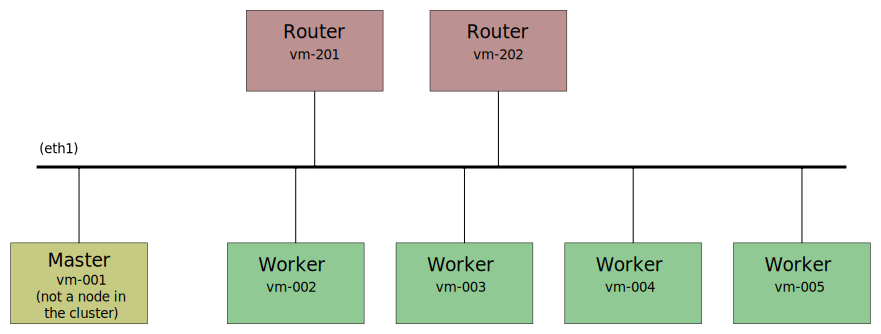

# Xcluster ovl - k8s-xcluster

- Kubernetes in `xcluster` with downloaded CNI-plugin.

This is and updated version of "ovl/kubernetes". It isolates the
"master" in a similar way as k3s;



The normal "hd-k8s-xcluster.img" does not include a CNI-plugin. A
CNI-plugin ovl should be used, e.g. `k8s-cni-xcluster`.


## Usage

```
export __image=$XCLUSTER_WORKSPACE/xcluster/hd-k8s-xcluster.img
export __nvm=5
xc mkcdrom k8s-cni-bridge; xc starts
```

## Build

```
ver=v1.17.0-rc.1
export KUBERNETESD=$ARCHIVE/kubernetes-$ver/server/bin
export __image=$XCLUSTER_WORKSPACE/xcluster/hd-k8s-xcluster-$ver.img
cp $XCLUSTER_WORKSPACE/xcluster/hd.img $__image
xc ximage xnet etcd iptools k8s-xcluster mconnect images
```


## Test

```
export __image=$XCLUSTER_WORKSPACE/xcluster/hd-k8s-xcluster.img
export XCTEST_HOOK=$($XCLUSTER ovld k8s-xcluster)/xctest-hook
export __nvm=5
t=test-template
XOVLS="k8s-cni-bridge" $($XCLUSTER ovld $t)/$t.sh test > $XCLUSTER_TMP/$t-test.log
XOVLS="k8s-cni-calico private-reg" $($XCLUSTER ovld $t)/$t.sh test > $XCLUSTER_TMP/$t-test.log
```

## Build k8s

```
cd $GOPATH/src/k8s.io/kubernetes
make WHAT=cmd/hyperkube
```
