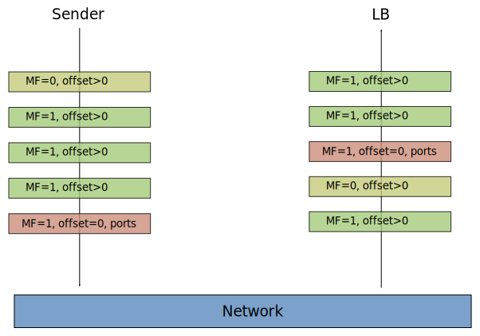

# Xcluster/ovl - load-balancer

* Test setup for load-balancers

This ovl provides a setup for testing different load-balancers
(without K8s). The default xcluster network-topology is used when
possible (always);


The routers (vm-201--vm-220) are used as load-balancing machines.
Only one tester is used (vm-221). The number of server VMs and
load-balancer VMs can be varied.

Ecmp does not work with linux > 5.4.x so download;
```
curl https://artifactory.nordix.org/artifactory/cloud-native/xcluster/images/bzImage-linux-5.4.35 > \
  $XCLUSTER_WORKSPACE/xcluster/bzImage-linux-5.4.35
```

Scaling tests and show a graph;
```
LB=nfqueue
__nvm=10 ./load-balancer.sh test --view ${LB}_scale > $log
__nvm=10 ./load-balancer.sh test ${LB}_scale_in > $log
__nvm=10 ./load-balancer.sh test ${LB}_scale_out > $log
__nvm=10 ./load-balancer.sh test --scale="1 2 3" ${LB}_scale_in > $log
```

Start using the `load-balancer.sh` script;
```
LB=ecmp
# Basic test and leave the cluster running;
./load-balancer.sh test --no-stop $LB > $log
# Or to just start;
./load-balancer.sh test start_$LB > $log
```

You can start manually;
```
LB=ecmp
SETUP=$LB xc mkcdrom env network-topology iptools load-balancer
__kver=linux-5.4.35 xc starts --ntesters=1 --nrouters=1
```
However some additional settings may be needed for some load-balancers.

Manual tests on the tester (vm-221);
```
mconnect -address 10.0.0.0:5001 -nconn 100 -srccidr 50.0.0.0/16
mconnect -address [1000::]:5001 -nconn 100 -srccidr 2000::/112
ctraffic -address 10.0.0.0:5003 -nconn 100 -rate 100 -monitor -timeout 10s \
  -stats all -srccidr 50.0.0.0/16 | jq .
ctraffic -address [1000::]:5003 -nconn 100 -rate 100 -monitor -timeout 10s \
  -stats all -srccidr 2000::/112 | jq .
```

## ECMP load-balancer

This is the simplest form of load-balancer. Due to some kernel bug
linux-5.5.x and above sprays packets regardless of hash so
`linux-5.4.35` is used in tests.

```
./load-balancer.sh test --view ecmp > $log
__nrouters=1 __nvm=10 ./load-balancer.sh test --scale=1 ecmp_scale_in > $log
__nrouters=1 __nvm=10 ./load-balancer.sh test --scale=5 ecmp_scale_in > $log
```

The scaling tests shows the Hash-Threshold used by the Linux kernel
([rfc2992](https://tools.ietf.org/html/rfc2992)). When scaling an
"edge" target ~50% traffic is lost but only ~25% when a "middle"
target is scaled.


## IPVS

The in-kernel load-balancer.

```
# "dsr" or "masq"
export xcluster_IPVS_SETUP=dsr
./load-balancer.sh test ipvs > $log
__nvm=10 ./load-balancer.sh test --view ipvs_scale > $log
```

There are no individual scale_out and scale_in tests for ipvs since it
is steteful so scale_out will not affect established connection and a
scale in will only affect the connections on the scaled backends.


## Maglev hashing

Maglev is the Google load-balancer;

* https://static.googleusercontent.com/media/research.google.com/en//pubs/archive/44824.pdf

In these examples the hash state is stored in "shared memory" so it is
accessible from the program doing load-balancing as well as from
programs performing various configurations;

```c
#define MAX_M 10000
#define MAX_N 100
struct MagData {
        unsigned M, N;
        int lookup[MAX_M];
        unsigned permutation[MAX_N][MAX_M];
        unsigned active[MAX_N];
};
```


The `maglev.c` has a test program which is rather crude but can be
extended (by you);

```
gcc -o /tmp/maglev src/maglev.c src/maglev-test.c
/tmp/maglev  # The example from p6 in the maglev doc
# /tmp/maglev M N seed -- Shows permutation, lookup and a scale in/out;
/tmp/maglev 20 5 1
# /tmp/maglev M N seed loops -- Test scale in/out and print % loss
/tmp/maglev 20 5 1 10
/tmp/maglev 10000 10 1 10  # Larger M comes nearer to the ideal (10%)
```

### Fragment handling

Described in section 4.3 p8 in the maglev document. 

> Each Maglev is configured with a special backend pool consisting of
> all Maglevs within the cluster.

When a fragment is received a 3-tuple hash is performend and the
packet is forwarded to a backend in this pool, i.e another
maglev. This maglev will get all fragments and maintain a state to
ensure all fragments are sent to the same backend.

We can do the same in `xcluster` fairly easy.

> We use the GRE recursion control field to ensure that fragments are
> only redirected once.

Since `xcluster` does not use GRE tunnels the `ownFwmark` can be
checked. If a fragment would be forwarded to our selves we handle the
packet.

Fragments can arrive in wrong order;



Only the firsts packet contain the ports.

This is likely the hardest case to handle. The fragments arriving
before the first fragment must be stored temporarily and re-sent when
the first fragment arrives. They can not be simply dropped since a
re-sent packet is likely to arrive in the same order.


## NFQUEUE

The `-j NFQUEUE` iptables target directs packets to a user-space
program. The program can analyze the packet, set `fwmark` and place a
"verdict".


Refs;

* https://home.regit.org/netfilter-en/using-nfqueue-and-libnetfilter_queue/
* http://www.netfilter.org/projects/libnetfilter_queue/doxygen/html/index.html

The NFQUEUE example uses "maglev hashing". The `lb` program when
listening on nfqueue ("lb run") creates a hash on src/dest addresses
and gets a "fwmark" from MagData.lookup.

The `lb` program is also used to create and configure the MagData in
shared memory. It can be built and executed on your laptop;

```
gcc -o /tmp/lb src/lb.c src/maglev.c -lmnl -lnetfilter_queue -lrt
/tmp/lb create -i 5 100 10
/tmp/lb show
/tmp/lb deactivate 1
/tmp/lb show
/tmp/lb activate 6 7 8
/tmp/lb show
/tmp/lb clean
```


### Tests

Manual test;
```
__nrouters=1 ./load-balancer.sh test start_nfqueue > $log
# On vm-221;
mconnect -address 10.0.0.0:5001 -nconn 100 -srccidr 50.0.0.0/16
ctraffic -address 10.0.0.0:5003 -nconn 100 -srccidr 50.0.0.0/16 -timeout 1m -monitor -rate 100
# On vm-201
lb show
lb deactivate 1
# ...
```

Scaling test;
```
#sudo apt install -y libnl-3-dev libnl-genl-3-dev libnetfilter-queue1
__nvm=10 __nrouters=1 ./load-balancer.sh test --view --scale="1 2" nfqueue_scale > $log
```

In this test the maximum vms are used (10) and just one load-balancer
(for no good reason). VMs 1 and 2 are scaled out and scaled in again
and a graph is presented. Example;


The ideal loss when 2 of 10 backends are scaled out is 20%, we lost
26% which is very good. When the backends comes back we lose a lot
fewer connections. This because the lookup table has 997 entries and
we have just 100 connections so it's a fair chance that existing
connections are preserved.

The hash algorithm can be controlled with the `xcluster_LB_OPTIONS`
variable;

```
# -p includes ports in the hash (fragments not handled)
# -m maglev|modulo defines the hash algorithm, default=maglev
export xcluster_LB_OPTIONS="-p -m modulo"
```

The NFQUEUE does not support stored packets to be re-injected, so some
other mechanism must be used for fragments, e.g. a raw socket or a tap
device.

### Improved NFQUEUE

For TCP it is not necessary to redirect *all* packets to
user-space. Only the `SYN` packets may be redirected and then we let
the "conntracker" take care of subsequent packets in the kernel.

This will not only boost performance for TCP it will also preserve all
existing connections when the clients are scaled since conntracker is
stateful.

When the lb's are scaled we must redirect all "untracked" packets to
user-space to recover.

**To be investigated**; Does the contracker recover? Or must we
  redirect untracked forever in case of lb scaling?


## DPDK based load-balancer

[DPDK](https://www.dpdk.org/) (Data Plane Development Kit) can be used
to process packets in user-space. With HW support is can be extremly
fast. In `xcluster` we have no HW and must use the kernel based DPDK
drivers like `af_socket` or `pcap`.

**Prerequisite**: You must firsts build DPDK locally as described in
[ovl/dpdk](../dpdk/). And `ovl/dpdk/Envsettings` must be sourced.


### l2lb

A very simple load-balancer using only MAC addresses.

```
cdo dpdk
. ./Envsettings
cdo load-balancer
./load-balancer.sh test dpdk > $log
# Manual
./load-balancer.sh test start_dpdk > $log
# On vm-201 (router)
l2lb show
```


## XDP

[XDP](https://en.wikipedia.org/wiki/Express_Data_Path) (Express Data
Path) provides yet another way to process packets in user-space.

**BUG**; At present connections are stuck in "ESTABLISHED" on the
  servers.

In this example a `eBPF` program is attached to `eth2`, called the
"ingress" interface. It filters packets with a VIP address as
destination and redirects them to user-space. The user-space program
re-writes the MAC addresses and sends the packet to a real server
through `eth1`, called the "egress" interface.


What makes XDP fast is that the "hook" where the eBPF program is
attached is very close to the NIC, before any Kernel handling
(e.g. allocation and copy to an `sk_buf`). The packet buffer buffers
are pre-allocated in memory shared by the kernel and user-space called
"UMEM". This allows zero-copy operation.

Packet buffers are transfered between kernel and user-space with
"rings" or "queues". An XF_XDP socket has 4 queues, two for receiving
(rx) and 2 for sending (tx). In this example we forward packets from
the ingress interface (eth2) to the egress interface (eth1).


## Usage


**Prerequisite**: You must firsts build the kernel and `bgplib` and
`bgptool` locally as described in [ovl/xdp](../xdp/). You must also
source `ovl/xdp/Envsettings`.

Prepare and test-build;
```
cdo xdp
. ./Envsettings
cdo load-balancer
eval $($XCLUSTER env | grep __kobj); export __kobj
make -C ./src/xdp O=/tmp/$USER/tmp
```

Run the test;
```
./load-balancer.sh test xdp > $log
```

For understanding it may be useful to setup everything manually.

Manual setup;
```
export __nrouters=1
./load-balancer.sh test start_xdp > $log
# On vm-201
#cat /sys/kernel/debug/tracing/trace_pipe  # If printouts from eBPF is on
# The ingress interface must have just one queue
ethtool -l eth2
ethtool -L eth2 combined 1

# Load eBPF programs and maps
bpftool prog loadall /bin/xdp_vip_kern.o /sys/fs/bpf/lb pinmaps /sys/fs/bpf/lb
ls /sys/fs/bpf/lb
mount | grep bpf

# Attach the eBPF program to the devices
ip link set dev eth2 xdpgeneric pinned /sys/fs/bpf/lb/xdp_vip
ip link set dev eth1 xdpgeneric pinned /sys/fs/bpf/lb/xdp_vip
ip link show dev eth2
#ip link set dev eth1 xdpgeneric none  # To detach

# Insert VIP addresses in the eBPF map
bpftool map show
bpftool map update name xdp_vip_map key hex 0 0 0 0 0 0 0 0 0 0 ff ff 0a 0 0 0 value 1 0 0 0
bpftool map update name xdp_vip_map key hex 10 0 0 0 0 0 0 0 0 0 0 0 0 0 0 0 value 1 0 0 0
bpftool map dump name xdp_vip_map

# Configure the maglev shared mem
xdplb init
xdplb activate --mac=0:0:0:1:1:1 0
xdplb activate --mac=0:0:0:1:1:2 1
xdplb activate --mac=0:0:0:1:1:3 2
xdplb activate --mac=0:0:0:1:1:4 3
xdplb show

# Start the load-balancer
xdplb lb --idev=eth2 --edev=eth1

# On vm-221
mconnect -address 10.0.0.0:5001 -nconn 100
ctraffic -address 10.0.0.0:5003 -monitor -nconn 50 -rate 50 -stats all -timeout 12s > /tmp/ctraffic
ctraffic -analyze hosts -stat_file /tmp/ctraffic
jq . < /tmp/ctraffic | less
```
