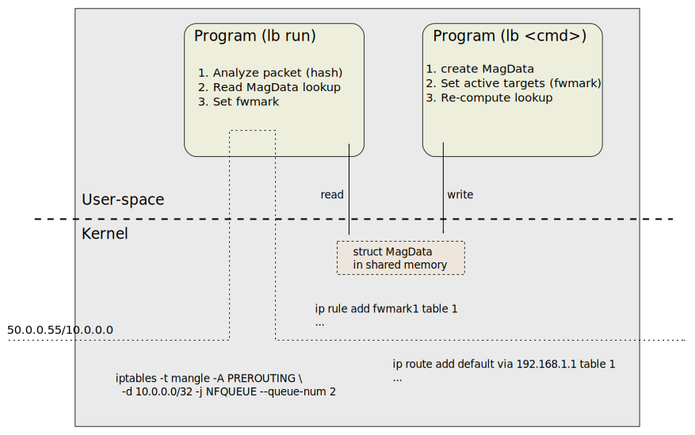

# Xcluster/ovl - load-balancer

* Test setup for load-balancers

This ovl provides a setup for testing different load-balancers
(without K8s). The default xcluster network-topology is used when
possible (always);


The routers (vm-201--vm-220) are used as load-balancing machines.
Only one tester is used (vm-221). The number of server VMs and
load-balancer VMs can be varied.

Ecmp does not work with linux > 5.4.x so download;
```
curl https://artifactory.nordix.org/artifactory/cloud-native/xcluster/images/bzImage-linux-5.4.35 > \
  $XCLUSTER_WORKSPACE/xcluster/bzImage-linux-5.4.35
```

Scaling tests and show a graph;
```
LB=nfqueue
__nvm=10 ./load-balancer.sh test --view ${LB}_scale > $log
__nvm=10 ./load-balancer.sh test ${LB}_scale_in > $log
__nvm=10 ./load-balancer.sh test ${LB}_scale_out > $log
__nvm=10 ./load-balancer.sh test --scale="1 2 3" ${LB}_scale_in > $log
```

Start using the `load-balancer.sh` script;
```
LB=ecmp
# Basic test and leave the cluster running;
./load-balancer.sh test --no-stop $LB > $log
# Or to just start;
./load-balancer.sh test start_$LB > $log
```

You can start manually;
```
LB=ecmp
SETUP=$LB xc mkcdrom env network-topology iptools load-balancer
__kver=linux-5.4.35 xc starts --ntesters=1 --nrouters=1
```
However some additional settings may be needed for some load-balancers.

Manual tests on the tester (vm-221);
```
mconnect -address 10.0.0.0:5001 -nconn 100 -srccidr 50.0.0.0/16
mconnect -address [1000::]:5001 -nconn 100 -srccidr 2000::/112
ctraffic -address 10.0.0.0:5003 -nconn 100 -rate 100 -monitor -timeout 10s \
  -stats all -srccidr 50.0.0.0/16 | jq .
ctraffic -address [1000::]:5003 -nconn 100 -rate 100 -monitor -timeout 10s \
  -stats all -srccidr 2000::/112 | jq .
```

## ECMP load-balancer

This is the simplest form of load-balancer. Due to some kernel bug
linux-5.5.x and above sprays packets regardless of hash so
`linux-5.4.35` is used in tests.

```
./load-balancer.sh test --view ecmp > $log
__nrouters=1 __nvm=10 ./load-balancer.sh test --scale=1 ecmp_scale_in > $log
__nrouters=1 __nvm=10 ./load-balancer.sh test --scale=5 ecmp_scale_in > $log
```

The scaling tests shows the Hash-Threshold used by the Linux kernel
([rfc2992](https://tools.ietf.org/html/rfc2992)). When scaling an
"edge" target ~50% traffic is lost but only ~25% when a "middle"
target is scaled.


## IPVS

The in-kernel load-balancer.

```
# "dsr" or "masq"
export xcluster_IPVS_SETUP=dsr
./load-balancer.sh test ipvs > $log
__nvm=10 ./load-balancer.sh test --view ipvs_scale > $log
```

There are no individual scale_out and scale_in tests for ipvs since it
is steteful so scale_out will not affect established connection and a
scale in will only affect the connections on the scaled backends.


## NFQUEUE

The `-j NFQUEUE` iptables target directs packets to a user-space
program. The program can analyze the packet, set `fwmark` and place a
"verdict".




Refs;

* https://home.regit.org/netfilter-en/using-nfqueue-and-libnetfilter_queue/
* http://www.netfilter.org/projects/libnetfilter_queue/doxygen/html/index.html


Scaling test;
```
#sudo apt install -y libnl-3-dev libnl-genl-3-dev libnetfilter-queue1
__nvm=10 __nrouters=1 ./load-balancer.sh test --view --scale="1 2" nfqueue_scale > $log
```

In this test the maximum vms are used (10) and just one load-balancer
(for no good reason). VMs 1 and 2 are scaled out and scaled in again
and a graph is presented. Example;


The ideal loss when 2 of 10 backends are scaled out is 20%, we lost
26% which is very good. When the backends comes back we lose a lot
fewer connections. This because the lookup table has 997 entries and
we have just 100 connections so it's a fair chance that existing
connections are preserved.

The hash algorithm can be controlled with the `xcluster_LB_OPTIONS`
variable;

```
# -p includes ports in the hash (fragments not handled)
# -m maglev|modulo defines the hash algorithm
export xcluster_LB_OPTIONS="-p -m modulo"
```


### Maglev hashing and the lb program

Maglev is the Google load-balancer;

* https://static.googleusercontent.com/media/research.google.com/en/pubs/archive/44824.pdf

The NFQUEUE example uses "maglev hashing". The hash state is stored in
"shared memory" so it is accessible from the program listening to the
nfqueue as well as from programs performing various configurations;

```c
#define MAX_M 10000
#define MAX_N 100
struct MagData {
        unsigned M, N;
        int lookup[MAX_M];
        unsigned permutation[MAX_N][MAX_M];
        unsigned active[MAX_N];
};
```

The `lb` program when listening on nfqueue ("lb run") creates a hash
on src/dest addresses and gets a "fwmark" from MagData.lookup.

The `lb` program is also used to create and configure the MagData in
shared memory. It can be built and executed on your laptop;

```
gcc -o /tmp/lb src/lb.c src/maglev.c -lmnl -lnetfilter_queue -lrt
/tmp/lb create -i 5 100 10
/tmp/lb show
/tmp/lb deactivate 1
/tmp/lb show
/tmp/lb activate 6 7 8
/tmp/lb show
/tmp/lb clean
```

The `maglev.c` has a stand-alone test which is rather crude but can be
extended (by you);

```
gcc -DSATEST -o /tmp/maglev src/maglev.c
/tmp/maglev  # The example from p6 in the maglev doc
# /tmp/maglev M N seed -- Shows permutation, lookup and a scale in/out;
/tmp/maglev 20 5 1
# /tmp/maglev M N seed loops -- Test scale in/out and print % loss
/tmp/maglev 20 5 1 10
/tmp/maglev 10000 10 1 10  # Larger M comes nearer to the ideal (10%)
```

### Manual tests

```
__nrouters=1 ./load-balancer.sh test start_nfqueue > $log
# On vm-221;
mconnect -address 10.0.0.0:5001 -nconn 100 -srccidr 50.0.0.0/16
ctraffic -address 10.0.0.0:5003 -nconn 100 -srccidr 50.0.0.0/16 -timeout 1m -monitor -rate 100
# On vm-201
lb show
lb deactivate 1
# ...
```
