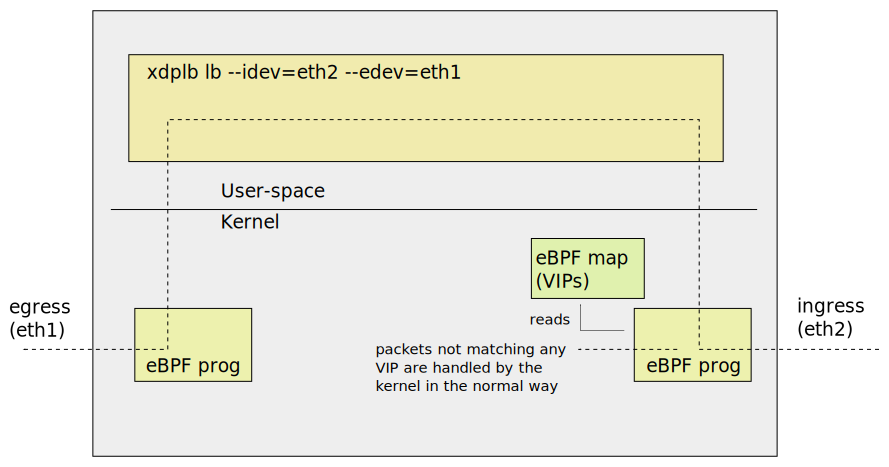
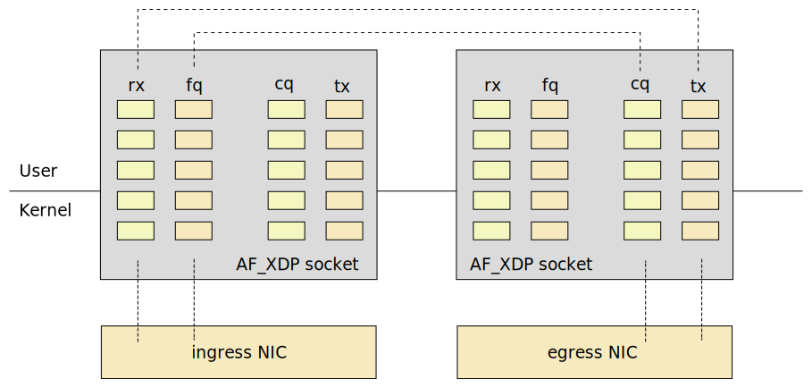

# Xcluster/ovl - load-balancer

This tests different load-balancers (without K8s). The default
xcluster network-topology is used;


The routers (vm-201--vm-220) are used as load-balancing machines.
Only one tester is used (vm-221). The number of server VMs and
load-balancer VMs can be varied.


Example; install the dependencies then;
```
__nvm=10 ./load-balancer.sh test --scale="1 2" --view nfqueue_scale > $log
```

This tests uses [nfqueue-loadbalancer/](https://github.com/Nordix/nfqueue-loadbalancer/)
which is a stateless load-balancer based on google `maglev`. 100 connections are
setup to 10 real-targets. Then real-targets 1 and 2 are removed and
re-added. The lost connections are printed and a plot is shown.


## Dependencies

* [ctraffic](https://github.com/Nordix/ctraffic) -- Used in traffic tests
* [mconnect](https://github.com/Nordix/mconnect) -- Fast connect tests
* [nfqueue-loadbalancer/](https://github.com/Nordix/nfqueue-loadbalancer/) -- In nfqlb tests
* `apt install -y libnl-3-dev libnl-genl-3-dev libnetfilter-queue1` -- needed by nfqueue-loadbalancer
* [gnuplot](http://www.gnuplot.info/) -- For plots (optional)
* [inkscape](https://inkscape.org/) -- To view plots (optional)
* Clone [ctraffic](https://github.com/Nordix/ctraffic) to $GOPATH/src/github.com/Nordix/ctraffic -- For plots (optional)

Ctraffic, mconnect and nfqueue-loadbalancer archives should be
downloaded to `$ARCHIVE` (defaults to ~/Downloads).


## ECMP load-balancer

Ecmp does not work with linux > 5.4.x so download;
```
curl https://artifactory.nordix.org/artifactory/cloud-native/xcluster/images/bzImage-linux-5.4.35 > \
  $XCLUSTER_WORKSPACE/xcluster/bzImage-linux-5.4.35
```

This is the simplest form of load-balancer. Due to some kernel bug
linux-5.5.x and above sprays packets regardless of hash so
`linux-5.4.35` is used in tests.

```
__nrouters=1 __nvm=10 ./load-balancer.sh test --scale=1 ecmp_scale_in > $log
__nrouters=1 __nvm=10 ./load-balancer.sh test --scale=5 ecmp_scale_in > $log
```

The scaling tests shows the Hash-Threshold used by the Linux kernel
([rfc2992](https://tools.ietf.org/html/rfc2992)). When scaling an
"edge" target ~50% traffic is lost but only ~25% when a "middle"
target is scaled.


## IPVS

The in-kernel load-balancer.

```
# "dsr" or "masq"
export xcluster_IPVS_SETUP=dsr
./load-balancer.sh test ipvs > $log
__nvm=10 ./load-balancer.sh test --view ipvs_scale > $log
```

There are no individual scale_out and scale_in tests for ipvs since it
is stateful so scale_out will not affect established connection and a
scale in will only affect the connections on the scaled backends.


## NFQUEUE

The `-j NFQUEUE` iptables target directs packets to a user-space
program. The program can analyze the packet, set `fwmark` and place a
"verdict". These are tests using the
[Nordix/nfqueue-loadbalancer](https://github.com/Nordix/nfqueue-loadbalancer/).


Refs;

* https://home.regit.org/netfilter-en/using-nfqueue-and-libnetfilter_queue/
* http://www.netfilter.org/projects/libnetfilter_queue/doxygen/html/index.html


### Tests

Manual test;
```
__nrouters=1 ./load-balancer.sh test start_nfqueue > $log
# On vm-221;
mconnect -address 10.0.0.0:5001 -nconn 100 -srccidr 50.0.0.0/16
ctraffic -address 10.0.0.0:5003 -nconn 100 -srccidr 50.0.0.0/16 -timeout 1m -monitor -rate 100
# On vm-201
nfqlb show
nfqlb deactivate 101
# ...
```

Scaling test;
```
#sudo apt install -y libnl-3-dev libnl-genl-3-dev libnetfilter-queue1
__nvm=10 ./load-balancer.sh test --view --scale="1 2" nfqueue_scale > $log
```

In this test the maximum vms are used (10).  VMs 1 and 2 are scaled
out and scaled in again and a graph is presented. Example;


The ideal loss when 2 of 10 backends are scaled out is 20%, we lost
26% which is very good. When the backends comes back we lose a lot
fewer connections. This because the lookup table has 997 entries and
we have just 100 connections so it's a fair chance that existing
connections are preserved.


### Only load-balance SYN for TCP

As described [here](https://github.com/Nordix/nfqueue-loadbalancer/blob/master/syn-only.md).

```
export xcluster_SYN_ONLY=yes
__nrouters=1 ./load-balancer.sh test start_nfqueue > $log
# On vm-221
ctraffic -address [1000::]:5003 -nconn 100 -srccidr 2000::/112 -timeout 30s -monitor -rate 100
# On vm-201
ip6tables -t mangle -vnL
# Note only 100 hits on the NFQUEUE rule
```


## DPDK based load-balancer

[DPDK](https://www.dpdk.org/) (Data Plane Development Kit) can be used
to process packets in user-space. With HW support is can be extremly
fast. In `xcluster` we have no HW and must use the kernel based DPDK
drivers like `af_socket` or `pcap`.

**Prerequisite**: You must firsts build DPDK locally as described in
[ovl/dpdk](../dpdk/). And `ovl/dpdk/Envsettings` must be sourced.


### l2lb

A very simple load-balancer using only MAC addresses.

```
cdo dpdk
. ./Envsettings
cdo load-balancer
./load-balancer.sh test dpdk > $log
# Manual
./load-balancer.sh test start_dpdk > $log
# On vm-201 (router)
l2lb show
# On vm 221
mconnect -address 10.0.0.0:5001 -nconn 100
```


## XDP

[XDP](https://en.wikipedia.org/wiki/Express_Data_Path) (Express Data
Path) provides yet another way to process packets in user-space.

**BUG**; At present connections are stuck in "ESTABLISHED" on the
  servers.

In this example a `eBPF` program is attached to `eth2`, called the
"ingress" interface. It filters packets with a VIP address as
destination and redirects them to user-space. The user-space program
re-writes the MAC addresses and sends the packet to a real server
through `eth1`, called the "egress" interface.




What makes XDP fast is that the "hook" where the eBPF program is
attached is very close to the NIC, before any Kernel handling
(e.g. allocation and copy to an `sk_buf`). The packet buffer buffers
are pre-allocated in memory shared by the kernel and user-space called
"UMEM". This allows zero-copy operation.

Packet buffers are transfered between kernel and user-space with
"rings" or "queues". An XF_XDP socket has 4 queues, two for receiving
(rx) and 2 for sending (tx). In this example we forward packets from
the ingress interface (eth2) to the egress interface (eth1).




## Usage


**Prerequisite**: You must firsts build the kernel and `bgplib` and
`bgptool` locally as described in [ovl/xdp](../xdp/). You must also
source `ovl/xdp/Envsettings`.

Prepare and test-build;
```
cdo xdp
. ./Envsettings
cdo load-balancer
make -C ./src/xdp O=/tmp/$USER/tmp
```

Run the test;
```
./load-balancer.sh test xdp > $log
```

For understanding it may be useful to setup everything manually.

Manual setup;
```
export __nrouters=1
./load-balancer.sh test start_xdp > $log
# On vm-201
#cat /sys/kernel/debug/tracing/trace_pipe  # If printouts from eBPF is on
# The ingress interface must have just one queue
ethtool -l eth2
ethtool -L eth2 combined 1

# Load eBPF programs and maps
bpftool prog loadall /bin/xdp_vip_kern.o /sys/fs/bpf/lb pinmaps /sys/fs/bpf/lb
ls /sys/fs/bpf/lb
mount | grep bpf

# Attach the eBPF program to the devices
ip link set dev eth2 xdpgeneric pinned /sys/fs/bpf/lb/xdp_vip
ip link set dev eth1 xdpgeneric pinned /sys/fs/bpf/lb/xdp_vip
ip link show dev eth2
#ip link set dev eth1 xdpgeneric none  # To detach

# Insert VIP addresses in the eBPF map
bpftool map show
bpftool map update name xdp_vip_map key hex 0 0 0 0 0 0 0 0 0 0 ff ff 0a 0 0 0 value 1 0 0 0
bpftool map update name xdp_vip_map key hex 10 0 0 0 0 0 0 0 0 0 0 0 0 0 0 0 value 1 0 0 0
bpftool map dump name xdp_vip_map

# Configure the maglev shared mem
xdplb init
xdplb activate --mac=0:0:0:1:1:1 0
xdplb activate --mac=0:0:0:1:1:2 1
xdplb activate --mac=0:0:0:1:1:3 2
xdplb activate --mac=0:0:0:1:1:4 3
xdplb show

# Start the load-balancer
xdplb lb --idev=eth2 --edev=eth1

# On vm-221
mconnect -address 10.0.0.0:5001 -nconn 100
ctraffic -address 10.0.0.0:5003 -monitor -nconn 50 -rate 50 -stats all -timeout 12s > /tmp/ctraffic
ctraffic -analyze hosts -stat_file /tmp/ctraffic
jq . < /tmp/ctraffic | less
```
