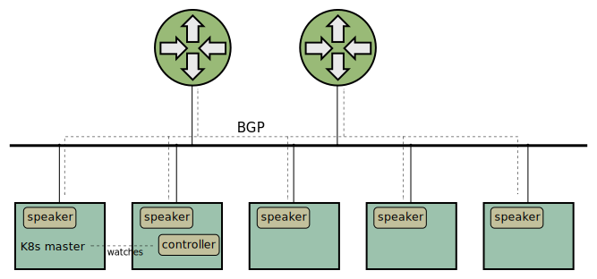

Xcluster overlay - metallb
==========================

For experiments with the [metallb](https://github.com/google/metallb).

The `metallb` is not a load-balancer despite the `lb` suffix. It makes
the service `type: LoadBalancer` work in a similar way as in public
clouds.

Metallb has two major (independent) functions;

* controller - Maintain and assign external addresses to services with `type:
  LoadBalancer`

* speaker - Announce the external addresses via BGP or L2




Usage
-----

Assuming `xcluster` k8s image;

```
configd=$($XCLUSTER ovld metallb)/default/etc/kubernetes
xc mkcdrom gobgp; xc start
# or
xc mkcdrom gobgp private-reg; xc start
kubectl apply -f https://raw.githubusercontent.com/google/metallb/v0.7.3/manifests/metallb.yaml
kubectl apply -f $configd/metallb-config.yaml
kubectl apply -f $configd/mconnect.yaml
kubectl get pods -n metallb-system
kubectl get svc
# On a router vm;
gobgp neighbor
ip ro
mconnect -address 10.0.0.2:5001 -nconn 400
```

Helm installstion (install helm and start `tiller` as described in the
[kubernets ovelay](../kubernetes/README.md);

```
configd=$($XCLUSTER ovld metallb)/default/etc/kubernetes
xc mkcdrom metallb gobgp; xc start
helm install --name metallb stable/metallb
kubectl apply -f $configd/metallb-config-helm.yaml
```

You can start a private docker registry to avoid loading from the
internet every time or images can be pre-pulled for faster (and safer)
operation for instance in CI environment;

```
curl -L  https://raw.githubusercontent.com/google/metallb/v0.7.3/manifests/metallb.yaml \
 > $($XCLUSTER ovld metallb)/default/etc/metallb.yaml
images make coredns docker.io/nordixorg/mconnect:0.2 \
 metallb/speaker:v0.7.3 metallb/controller:v0.7.3
xc mkcdrom metallb gobgp images; xc start
# On cluster;
images         # to check that the metallb images are pre-pulled
kubectl apply -f /etc/kubernetes/metallb-config.yaml
kubectl apply -f /etc/metallb.yaml
kubectl get pods -n metallb-system
kubectl apply -f /etc/kubernetes/mconnect.yaml
```


## Home-built pod

For internal experiments a local pod can be used;

Ipv4 setup;

```
images make coredns metallb docker.io/nordixorg/mconnect:0.2
xc mkcdrom metallb gobgp images; xc start
# On cluster;
kubectl apply -f /etc/kubernetes/metallb-config-internal.yaml
kubectl apply -f /etc/kubernetes/metallb.yaml
kubectl apply -f /etc/kubernetes/metallb-speaker.yaml
kubectl apply -f /etc/kubernetes/mconnect.yaml
kubectl get pods
kubectl logs pod/...
kubectl get svc
# On router;
gobgp neighbor
ip ro
# Outside cluster;
mconnect -address 10.0.0.2:5001 -nconn 1000
```


IPv6 setup;

```
images make coredns metallb docker.io/nordixorg/mconnect:0.2
SETUP=ipv6 xc mkcdrom etcd coredns k8s-config metallb gobgp images; xc start
```


Build
-----

Read the instructions on the
[contributing](https://metallb.universe.tf/community/#contributing) page.

```
go get -u go.universe.tf/metallb
cd $GOPATH/src/go.universe.tf/metallb
git checkout v0.7.3
go install go.universe.tf/metallb/speaker
go install go.universe.tf/metallb/controller
strip $GOPATH/bin/controller $GOPATH/bin/speaker
```

IP address sharing
------------------

Metallb supports that several services share the same `loadBalancerIP`
(VIP) (described
[here](https://metallb.universe.tf/usage/#ip-address-sharing)).

But the restriction for `ExternalTrafficPolicy: Local`; "the *exact
same selector" makes k8s distribure traffic to all sevices to all
pods.

