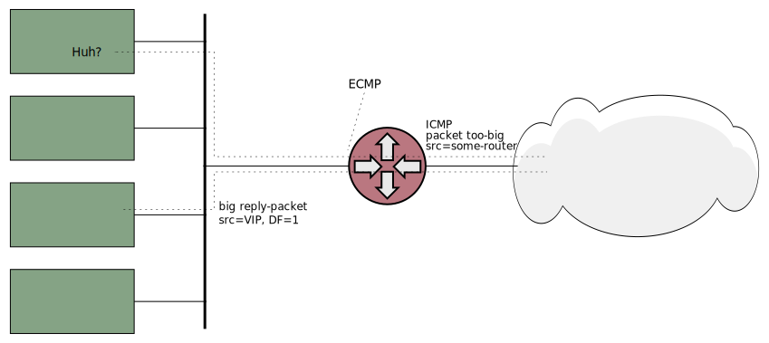
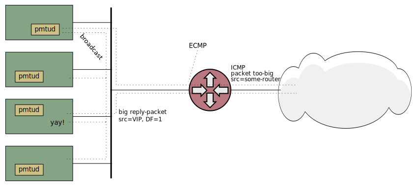
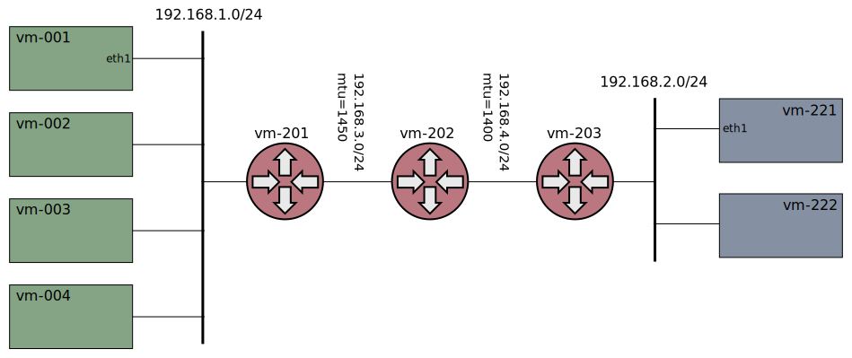
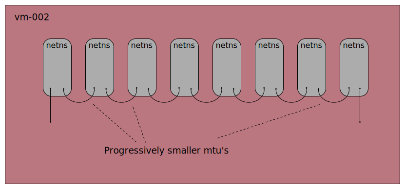

# Xcluster ovl - mtu

* Tests with different MTU sizes with and without Kubernetes.

Test jumbo frames in the K8s network with different CNI-plugins
(currently only [xcluster-cni](https://github.com/Nordix/xcluster-cni)).

Test of the [ecmp/pmdu-discovery
problem](https://blog.cloudflare.com/path-mtu-discovery-in-practice/).


## MTU in xcluster

First; MTU tests must be performed in a netns since the user-space
networking does not handle jumbo frames.

```
__mtu=9000 xc starts
```

This will set the mtu on all tab devices and (implicitly) the bridges;
```
ifconfig xcbr1
xcbr1: flags=4163<UP,BROADCAST,RUNNING,MULTICAST>  mtu 9000
...
```

It will also append strings like "mtu1=9000" to the kernel
command-line which can be read from within the VMs;

```
cat /proc/cmdline 
noapic root=/dev/vda rw init=/init  mtu0=9000 mtu1=9000
```

This is then used to set the mtu on the interfaces in all VMs;
```
ifconfig eth1
eth1      Link encap:Ethernet  HWaddr 00:00:00:01:01:03  
...
          UP BROADCAST RUNNING MULTICAST  MTU:9000  Metric:1
```


## Jumbo frames with K8s

Note that mtu tests shall be performed with a CNI-plugin so
`k8s-xcluster` shall be used.

Run test;
```
log=/tmp/$USER-xcluster.log
__k8sver=v1.18.3 ./xcadmin.sh k8s_test --cni=xcluster mtu > $log
```

Manual;
```
export __mtu=9000
export __image=$XCLUSTER_WORKSPACE/xcluster/hd-k8s-xcluster.img
export __nvm=5
export __mem=1536
export XOVLS="k8s-cni-xcluster private-reg"
xc mkcdrom mtu; xc starts
# On vm-001;
ifconfig eth1    # Check MTU:9000
tracepath -n 192.168.1.2
tracepath -n 1000::1:192.168.1.2
/bin/ping -nc1 -W1 -s 8972 -M do 192.168.1.2
/bin/ping -nc1 -W1 -s 8952 -M do 1000::1:192.168.1.2
/bin/ping -nc1 -W1 -s 8974 -M do 192.168.1.2
/bin/ping -nc1 -W1 -s 8954 -M do 1000::1:192.168.1.2
# On vm-002;
tcpdump -eni eth1 icmp or icmp6
```

### Pmtu inside PODs

The POD network may have a larger MTU than the path to an external
peer, e.g when jumbo-frames are used internally. When a POD is
accessed from an external client via a service the POD will try to
respond with a too-big packet and it is essential that the ICMP
packets really is routed back to the POD. To test this the "backend"
network topology is used.


Jumbo-frames are not used but the "frontend" network is configured
with mtu=1400. A POD will send a packet with it's max mtu which is >1400
but the outgoing path have mtu=1400.

Test;
```
log=/tmp/$USER-xcluster.jog
xcluster_PROXY_MODE=iptables ./xcadmin.sh k8s_test --cni=calico mtu backend_http > $log
```

That work. So to test manually for some "tcpdump" do;
```
xcluster_PROXY_MODE=iptables ./xcadmin.sh k8s_test --cni=calico mtu backend_start_limit_mtu > /dev/null
# (the cluster is left running)
kubectl get pods
kubectl exec -it mserver-daemonset-... -- sh
# In the pod;
tcpdump -lni eth0
# On vm-221
wget -O /dev/null http://10.0.0.2  # (may have to be repeated some times)
```

Trace example;
```
15:22:09.790403 ARP, Request who-has 11.0.40.65 tell 192.168.0.5, length 28
15:22:09.790433 ARP, Reply 11.0.40.65 is-at 22:21:7a:8d:bd:d8, length 28
15:22:09.790437 IP 192.168.2.221.57200 > 11.0.40.65.80: Flags [S], seq 1568849216, win 64240, options [mss 1460,sackOK,TS val 3813805410 ecr 0,nop,wscale 7], length 0
15:22:09.790450 ARP, Request who-has 169.254.1.1 tell 11.0.40.65, length 28
15:22:09.790454 ARP, Reply 169.254.1.1 is-at ee:ee:ee:ee:ee:ee, length 28
15:22:09.790455 IP 11.0.40.65.80 > 192.168.2.221.57200: Flags [S.], seq 1597526885, ack 1568849217, win 65236, options [mss 1400,sackOK,TS val 2682440094 ecr 3813805410,nop,wscale 7], length 0
15:22:09.790905 IP 192.168.2.221.57200 > 11.0.40.65.80: Flags [.], ack 1, win 502, options [nop,nop,TS val 3813805411 ecr 2682440094], length 0
15:22:09.790934 IP 192.168.2.221.57200 > 11.0.40.65.80: Flags [P.], seq 1:72, ack 1, win 502, options [nop,nop,TS val 3813805411 ecr 2682440094], length 71: HTTP: GET / HTTP/1.1
15:22:09.790944 IP 11.0.40.65.80 > 192.168.2.221.57200: Flags [.], ack 72, win 510, options [nop,nop,TS val 2682440094 ecr 3813805411], length 0
15:22:09.792331 IP 11.0.40.65.80 > 192.168.2.221.57200: Flags [P.], seq 1:191, ack 72, win 510, options [nop,nop,TS val 2682440096 ecr 3813805411], length 190: HTTP: HTTP/1.0 200 OK
15:22:09.792445 IP 11.0.40.65.80 > 192.168.2.221.57200: Flags [.], seq 191:1579, ack 72, win 510, options [nop,nop,TS val 2682440096 ecr 3813805411], length 1388: HTTP
15:22:09.792449 IP 11.0.40.65.80 > 192.168.2.221.57200: Flags [P.], seq 1579:2967, ack 72, win 510, options [nop,nop,TS val 2682440096 ecr 3813805411], length 1388: HTTP
15:22:09.792474 IP 192.168.0.5 > 11.0.40.65: ICMP 192.168.2.221 unreachable - need to frag (mtu 1400), length 556
15:22:09.792478 IP 192.168.0.5 > 11.0.40.65: ICMP 192.168.2.221 unreachable - need to frag (mtu 1400), length 556
15:22:09.792489 IP 11.0.40.65.80 > 192.168.2.221.57200: Flags [.], seq 191:1539, ack 72, win 510, options [nop,nop,TS val 2682440096 ecr 3813805411], length 1348: HTTP
15:22:09.792490 IP 11.0.40.65.80 > 192.168.2.221.57200: Flags [.], seq 1539:2887, ack 72, win 510, options [nop,nop,TS val 2682440096 ecr 3813805411], length 1348: HTTP
15:22:09.792491 IP 11.0.40.65.80 > 192.168.2.221.57200: Flags [P.], seq 2887:2967, ack 72, win 510, options [nop,nop,TS val 2682440096 ecr 3813805411], length 80: HTTP
15:22:09.792709 IP 11.0.40.65.80 > 192.168.2.221.57200: Flags [FP.], seq 2967:3689, ack 72, win 510, options [nop,nop,TS val 2682440096 ecr 3813805411], length 722: HTTP
15:22:09.792935 IP 192.168.2.221.57200 > 11.0.40.65.80: Flags [.], ack 191, win 501, options [nop,nop,TS val 3813805413 ecr 2682440096], length 0
15:22:09.792961 IP 192.168.2.221.57200 > 11.0.40.65.80: Flags [.], ack 2967, win 480, options [nop,nop,TS val 3813805413 ecr 2682440096], length 0
15:22:09.793494 IP 192.168.2.221.57200 > 11.0.40.65.80: Flags [F.], seq 72, ack 3690, win 501, options [nop,nop,TS val 3813805413 ecr 2682440096], length 0
15:22:09.793529 IP 11.0.40.65.80 > 192.168.2.221.57200: Flags [.], ack 73, win 510, options [nop,nop,TS val 2682440097 ecr 3813805413], length 0
```

## Pmtu discovery with ECMP without K8s

There is a problem with pmtu discovery with ECMP described in depth here;

* https://blog.cloudflare.com/path-mtu-discovery-in-practice/
* https://blog.cloudflare.com/increasing-ipv6-mtu/




In short; the packet-too-big ICMP packet is routed to a random VM by
ECMP.

#### The pmtu work-around



The `pmtud` catches the "fragmentation-needed" packets and broadcast
them to all nodes.


#### Test setup

A variation of the `multihop` [network-topology](../network-topology)
with smaller MTUs in the router networks is used;



NIC "offload" must be disabled or else you will see packets > mtu in
your traces. This is done by the test scripts;

```
ethtool -K eth1 gro off gso off tso off
```

**NOTE**; NIC offload does not work with user-space networking so use a netns.

A http request from an external source to the VIP address with a
rather large reply is assumed to be the most realistic test. Tests are
prepared for http without any precautions (fails) and work-arounds
with `limited-mtu` and `pmtud`.

Traces with `tcpdump` is done in strategic places. The capture on the
router vm-201 captures just about everything, including the `pmtud`
broadcasted packets.


#### Prerequisite

Build `pmtud`;
```
sudo apt install -y libpcap-dev libnetfilter-log-dev
# Clone to $GOPATH/src/github.com/cloudflare/pmtud
make -j$(nproc) -f Makefile.pmtud
```

#### Run tests

```
cdo mtu
./mtu.sh test http_vanilla > /dev/null  # (fails)
./mtu.sh test http_limit_mtu > /dev/null
./mtu.sh test http_pmtud > /dev/null
```


Manual ECMP test;
```
./mtu.sh test vip_setup > /dev/null
# On vm-221
mconnect -address 10.0.0.0:5001 -nconn 100
mconnect -address [1000::1:10.0.0.0]:5001 -nconn 100
wget -O- http://10.0.0.0/index.html
# On vm-001
tracepath -n 20.0.0.0
ip ro replace 20.0.0.0/24 via 192.168.1.201 src 10.0.0.0
tracepath -n 20.0.0.0     # Does not work!

tracepath -n 1000::1:20.0.0.0
ip ro replace 1000::1:20.0.0.0/120 via 1000::1:192.168.1.201 src 1000::1:10.0.0.0
```

Great, we have two work-arounds, but...


## Pmtu discovery with ECMP with K8s

Unfortunately neither the limited-mtu nor the pmtud work-arounds work
with K8s.


#### Test without ECMP

Just to see how it should work. The route to the VIP address on vm-201
is setup only to `vm-003` (no ECMP).

```
# (in a netns)
log=/tmp/$USER/xcluster-test.log
__no_ecmp=yes ./mtu.sh test multihop_capture > $log
# Pcap captures in /tmp/$USER/pcap
```

Pcap captures;

* [Router, vm-201](pcap/no-ecmp/vm-201-eth1.pcap)
* [vm-003](pcap/no-ecmp/vm-003-eth1.pcap)
* [In the POD on vm-003](pcap/no-ecmp/mserver-vm-003.pcap)

"Fragmentation Needed" packets from vm-201 (mtu=1400) and from vm-202
(mtu=1300) are correctly forwarded all the way to the POD.

#### Test with ECMP

```
log=/tmp/$USER/xcluster-test.log
./mtu.sh test multihop_capture > $log
```

In this particular run the ECMP picked vm-003 for the request but the
"Fragmentation Needed" from vm-202 packet is ECMP'ed to vm-002.

Pcap captures;

* [Router, vm-201](pcap/ecmp/vm-201-eth1.pcap)
* [vm-003](pcap/ecmp/vm-003-eth1.pcap)
* [vm-002](pcap/ecmp/vm-002-eth1.pcap)
* [In the POD on vm-003](pcap/ecmp/mserver-vm-003.pcap)


## Squeeze Chain



This is a one-vm variation of the mtu ladder. A number of network
name-spaces (netns) are chained with `veth` pairs. The mtu size is
progressively smaller.

Incoming traffic is forced into the squeeze-chain with iptables rules
and routes.

``
./mtu.sh test start_squeeze > $log`
# on vm-001
vm-001 ~ # tracepath 20.0.0.0
 1?: [LOCALHOST]                      pmtu 1500
 1:  192.168.1.201                                         1.827ms 
 1:  192.168.1.201                                         1.174ms 
 2:  192.168.1.201                                         0.990ms pmtu 1480
 2:  10.200.1.2                                            1.035ms 
 3:  10.200.1.2                                            0.980ms pmtu 1460
 3:  10.200.2.2                                            1.176ms 
 4:  10.200.2.2                                            1.021ms pmtu 1440
 4:  10.200.3.2                                            1.215ms 
 5:  10.200.3.2                                            1.102ms pmtu 1420
 5:  10.200.4.2                                            1.090ms 
 6:  10.200.4.2                                            0.878ms pmtu 1400
 6:  10.200.5.2                                            1.038ms 
 7:  10.200.5.2                                            1.146ms pmtu 1380
 7:  10.200.6.2                                            1.409ms 
 8:  10.200.6.2                                            1.123ms pmtu 1360
 8:  10.200.7.2                                            1.336ms 
 9:  10.200.7.2                                            1.165ms pmtu 1340
 9:  10.200.8.2                                            1.321ms 
10:  10.200.8.2                                            1.230ms pmtu 1320
10:  10.200.9.2                                            1.350ms 
11:  10.200.9.2                                            1.192ms pmtu 1300
11:  10.200.10.2                                           1.391ms 
12:  192.168.1.201                                         1.208ms asymm  1 
13:  20.0.0.0                                              2.952ms reached
     Resume: pmtu 1300 hops 13 back 2 
```