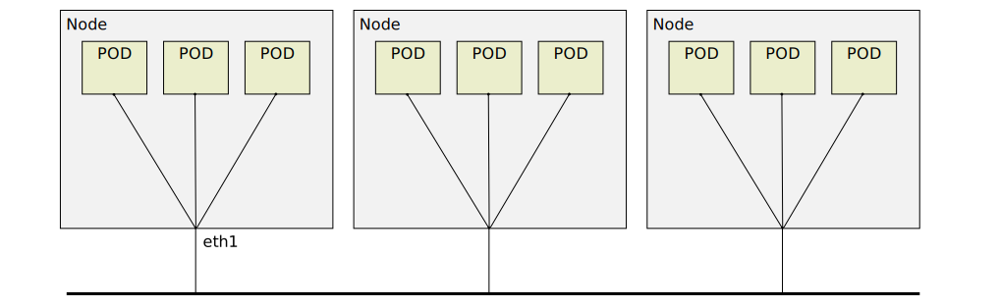

# Xcluster/ovl - netns

Multiple Network Namespaces (netns) and interconnect. The Network
Namespaces are called "PODs" in this document even though K8s is
not used.

Keyword; netns, CNI-bridge, veth, unshare


This is the most common setup for CNI-plugins. The "bridge" is not
necessarily a Linux bridge, it may be something else like `OVS`.

## Usage

This ovl is intended to be used by other ovl's. Check the output from;
```
./default/bin/netns_test
```

Example;
```
./netns.sh test start > $log
# On vm-001;
# Create 10 netns'es;
netns_test create 10
# Check them;
ip netns
# Execute something in a netns;
netns_test exec vm-001-ns03 hostname
```

The `netns_test exec` will set the hostname name space (uts) so the
hostname will become something like "vm-001-ns03". The `ip netns exec`
will not set the `utsns` so you will see the node hostname.

Environment variables;
```
export xcluster_NPODS=4
export xcluster_ADRTEMPLATE=172.16.0.0/16/24
export xcluster_PODIF=eth0
#export xcluster_PODIF=hostname  # Use pod name as interface name
```

### Prerequisite

All address function requires the `ipu` utility from
[nfqlb](https://github.com/Nordix/nfqueue-loadbalancer/). A `nfqlb`
release dir can be specified in $NFQLBDIR.

```
export NFQLBDIR=$HOME/tmp/nfqlb-1.0.0
```

## POD addresses

PODs are assigned addresses from the $ADRTEMPLATE. The `ipu` program
is used to create an address. Example;

```
# POD 3 on vm-002 may get addresses;
ipu makeip --cidr=172.16.0.0/16/24 --net=2 --host=3
ipu makeip --cidr=172.16.0.0/16/24 --net=2 --host=3 --ipv6template=1000::1:0.0.0.0
```

### Random addresses

For flat networks the address assignment above is just "too structured".
We want some more random. A file with random mumbers 1-254 is created
by the `./tar` script so it's the same on all nodes.

```
seq 1 254 | shuf > $tmp/etc/rnd-addresses
```

The first $__nvm numbers are reserved for nodes (bridges), the rest is
sliced up to PODs. The last byte for addresses is taken from
`/etc/rnd-addresses`. Example;

```
# POD 3 on vm-002 may get addresses ($NPODS=pods-per-node);
NPODS=4
position=$((__nvm + 1 * NPODS + 3))
tail +$position /etc/rnd-addresses | head -1
netns_test rndaddress_pods 2  # print all random POD addresses on vm-002
```

## Direct access

In some cases the `veth` pair is not needed, for instance for `ipvlan`
and `macvlan`. The POD interface is directly attached to a physical device.




## Test

```
./netns.sh      # Help printout
# Run a test;
./netns.sh test bridge > $log
```

#### CNI-bridge

To connect all netns to a bridge you *may* use the
[CNI-bridge](https://www.cni.dev/plugins/current/main/bridge/) plugin.

This requires a cni-plugins release archive in $ARCHIVE or
$HOME/Downloads.

Test;
```
test -r $HOME/Downloads/cni-plugins-linux-amd64-v1.0.1.tgz && echo "CNI OK"
./netns.sh test cni_bridge > $log
```

The output (json) from the `bridge` cni-plugin is stored in files on
`/tmp`. To get all assigned addresses do;

```
cat /tmp/$(hostname)-ns* | jq -r .ips[].address | cut -d/ -f1
```
