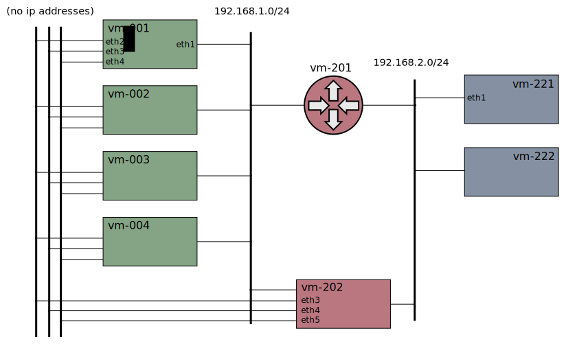
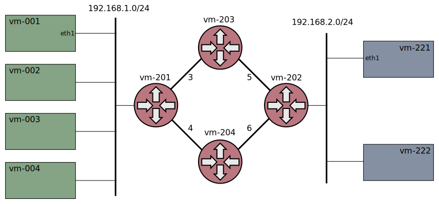
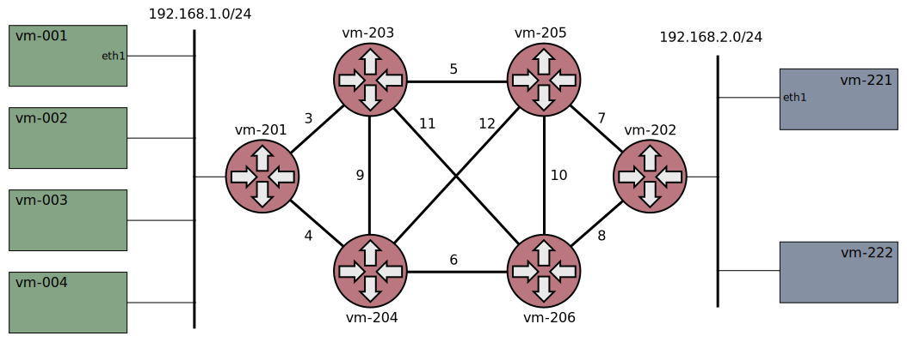

# Xcluster/ovl - network-topology

Various network topology setups are defined in this ovl.

Keywords: topology, DAD (multilan_router)


The maintenance network 0 (eth0) is alway setup but is not shown here.

An addressing pattern is used. All VMs gets addresses as;

```
PREFIX=fd00:
ip addr add ethX 192.168.$net.$i
ip -6 addr add ethX $PREFIX:192.168.$net.$i
```

Where `$i` is the vm-number, like 221 for "vm-221".

A local DNS server (CoreDNS) is also setup on all VMs by this ovl.


## Usage

Generic;
```
export TOPOLOGY=...
. $($XCLUSTER ovld network-topology)/$TOPOLOGY/Envsettings
xc mkcdrom iptools network-topology ...
```

Default;
```
xc mkcdrom iptools network-topology ...
# Eqivalent to;
xc mkcdrom iptools xnet ...
```

Usually the number of VMs and testers can be scaled by setting `__nvm`
and `__ntesters` but most setups must have a defined number of
routers, so setting `__nrouters` should be avoided.

Note that the settings in `$TOPOLOGY/Envsettings` must be included if
you scaleout:

```
# For TOPOLOGY=multilan-router
__nets_vm=0,1,3,4,5 xc scaleout 193
```

## Test

```

# Start;
TOPOLOGY=... ./network-topology.sh test start > $log
# Test all topologies;
./network-topology.sh test
# Test a specific topology
./network-topology.sh test $TOPOLOGY > $log
```


## Xnet


This is the "default" xcluster network topology described
[here](../../doc/networking.md). This obsoletes [ovl/xnet](../xnet/).


## Dual-path


This setup is used for tests with multi-path/multi-homing e.g MPTCP or
SCTP with multi-homing.


## Multihop


For [PMTU](../mtu) and traceroute tests.


## Zones


The VMs are distributed to different networks. Since the VMs are not
in a consecutive sequence the VMs in the "zones" must be
scaled-out.

```
export TOPOLOGY=zones
. $(XCLUSTER ovld network-topology)/$TOPOLOGY/Envsettings
xc mkcdrom iptools network-topology ...
xc starts
xc scaleout 10 11 20 21
# (do some testing...)
xc stop
```

## Backend


The cluster has a "backend" network for internal communication. All
communication with the outside world goes through a "frontend"
network.

## Bridge


This is a simple bridged network with the same IP network across all
nodes. Traffic is bridged by the router between the VMs and testers.

## Multilan


The cluster VMs has multiple networks for test of
[Multus](https://github.com/intel/multus-cni),
[NSM](https://networkservicemesh.io/),
[DANM](https://github.com/nokia/danm), etc.

No ip addresses are assigned to the interfaces since that is assumed
to be done by the tested SW.

## Multilan-router

An improved version of `multilan` originally defined for
[ovl/nsm-vlan-dpdk](https://github.com/Nordix/nsm-test/blob/master/ovl/nsm-vlan-dpdk) but used elsewhere.



To assign addresses to the extra interfaces define `XLAN_TEMPLATE`;
```
export xcluster_XLAN_TEMPLATE=169.254.0.0/20/24
```

The `src/mkadr.c` program is used. Help printout;
```
Syntax:
  mkadr template net host

'template' is a cidr address with double slashes for net and
host masks. Example;

  192.168.128/17/24
  1000:2000:3000::3:0/112/120

The address is formed by inserting 'net' and 'host' in the
bit-fields. Example

  # mkadr 192.168.128.0/17/24 3 12
  192.168.131.12
  # mkadr 1000::192.168.0.0/112/120 3 1
  1000::c0a8:301
```


## Evil tester


An "evil tester" is added to the path intended for doing bad things
with traffic for test purposes.


## Diamond



For basic experiments with multi-path networks, e.g with
[SRv6](https://en.wikipedia.org/wiki/Segment_routing). The upper is
the "odd" path, the lower is the "even" path.

## X-diamond



The most complex network so far. Same usage as `diamond`.


