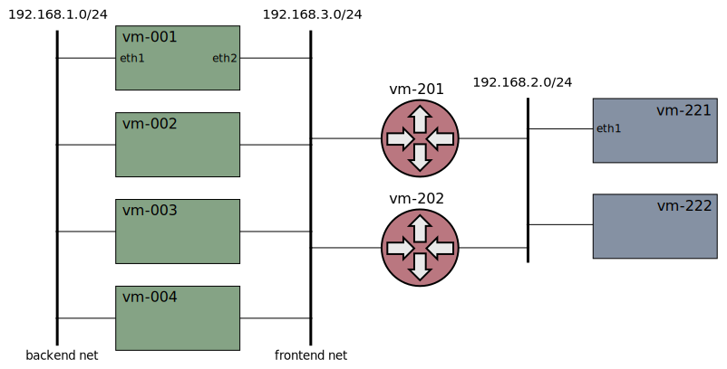

# Xcluster/ovl - network-topology

* Network topologies in xcluster

Various network topology setups are defined in this ovl.

The maintenance network 0 (eth0) is alway setup but is not shown here.

An addressing pattern is used. All VMs gets addresses as;

```
PREFIX=1000::1
ip addr add ethX 192.168.$net.$i
ip -6 addr add ethX $PREFIX:192.168.$net.$i
```

Where `$i` is the vm-number, like 221 for "vm-221".

A local DNS server (CoreDNS) is also setup on all VMs by this ovl.


## Usage

Generic;
```
export TOPOLOGY=...
. $($XCLUSTER ovld network-topology)/$TOPOLOGY/Envsettings
xc mkcdrom iptools network-topology ...
```

Default;
```
xc mkcdrom iptools network-topology ...
# Eqivalent to;
xc mkcdrom iptools xnet ...
```

Usually the number of VMs and testers can be scaled by setting `__nvm`
and `__ntesters` but most setups must have a defined number of
routers, so setting `__nrouters` should be avoided.


## Test

```
# Test all topologies;
./network-topology.sh test
# Test a specific topology
./network-topology.sh test $TOPOLOGY > $log
```


## Xnet


This is the "default" xcluster network topology described
[here](../../doc/networking.md). This obsoletes [ovl/xnet](../xnet/).


## Dual-path


This setup is used for tests with multi-path/multi-homing e.g MPTCP or
SCTP with multi-homing.


## Multihop


For [PMTU](../mtu) and traceroute tests.


## Zones


The VMs are distributed to different networks. Since the VMs are not
in a consecutive sequence the VMs in the "zones" must be
scaled-out. Further the `xc stop` must be invoked with an option to
ensure all VMs are stopped.

```
export TOPOLOGY=zones
. $(XCLUSTER ovld network-topology)/$TOPOLOGY/Envsettings
xc mkcdrom iptools network-topology ...
xc starts
xc scaleout 10 11 20 21
# (do some testing...)
xc stop --nvm=30
```

## Backend



The cluster has a "backend" network for internal communication. All
communication with the outside world goes through a "frontend"
network.


## Multilan


The cluster VMs has multiple networks for test of
[Multus](https://github.com/intel/multus-cni),
[NSM](https://networkservicemesh.io/),
[DANM](https://github.com/nokia/danm), etc.

No ip addresses are assigned to the interfaces since that is assumed
to be done by the tested SW.


## Evil tester


An "evil tester" is added to the path intended for doing bad things
with traffic for test purposes.
