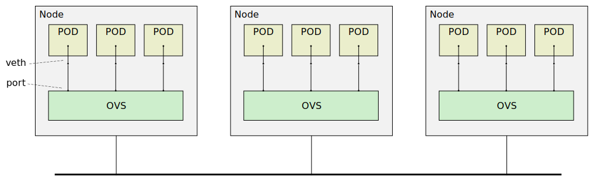

# Xcluster/ovl - ovs

Tests and experiments with [Open vSwitch](https://www.openvswitch.org/) (OVS).
OVS is used in the xcluster VMs, *not on the host* as a VM-VM
network (as the image on [www.openvswitch.org](https://www.openvswitch.org/)
shows).

OVS is an [OpenFlow](https://en.wikipedia.org/wiki/OpenFlow) enabled
virtual switch. It can operate in the Linux kernel or in user-space
(and use for instance DPDK to get traffic) and some smart-nics offers
[OVS HW offload](https://docs.nvidia.com/networking/display/MLNXOFEDv471001/OVS+Offload+Using+ASAP2+Direct).



The figure shows a common setup. The `veth` pair *may* be omitted and
an "internal" OVS port may be injected in the PODs, but an [old bug](
https://mail.openvswitch.org/pipermail/ovs-discuss/2015-July/038205.html)
makes naming of the interface inside the POD impossible.
The name "POD" is used even though K8s is not used, please see
[ovl/netns](../netns).


## Build

Prerequisite; autoconf and libtool installed. For documentation also
`sphinx-build` (sudo apt install python3-sphinx).

```
# Built in $GOPATH/src/github.com/openvswitch/ovs by default
./ovs.sh build   # Will build with XDP support if available
# Or;
./ovs.sh build --dest=/tmp  # Build in /tmp/ovs
```

Now `ovs` should be installed in "SYSD";
```
eval $(./ovs.sh env | grep SYSD)
ls $SYSD/usr/local/bin/
```

The `ovs` man-pages have also been built;
```
./ovs.sh man     # List ovs man-pages
./ovs.sh man ovs-vsctl
```

### Build with XDP support

See [afxdp doc](https://docs.openvswitch.org/en/latest/intro/install/afxdp/).

You must first build `libbpf` in [ovl/xdp](../xdp). This will in
turn require a locally built Linux kernel;

```
cdo xdp
./xdp.sh libbpf_build
cdo ovs
./ovs.sh build
```


## Basic operation

The most described usage in examples and tutorials is to use OVS as a
Linux bridge replacement. Which one is best [depends on the use-case](
https://www.fiber-optic-transceiver-module.com/ovs-vs-linux-bridge-who-is-the-winner.html).
(it would be interresting to know if HW offload can be used in this case)

Example with a Linux bridge;
```
./ovs.sh test start > $log
# On vm-001;
ip link add name br0 type bridge
ip link set up dev br0
ip addr add 172.16.1.0/24 dev br0
ip link set dev vm-001-ns01 master br0
ping 172.16.1.1
```

The same with an OVS bridge;
```
./ovs.sh test start > $log
# On vm-001;
ovs-vsctl add-br br0
ip link set up dev br0
ip addr add 172.16.1.0/24 dev br0
ovs-vsctl add-port br0 vm-001-ns01
ping 172.16.1.1
```

In both cases inter-node connection can be done by adding a physical
interface (e.g eth1) to the bridge. OVS does however offers other options,
e.g with VXLAN.

Automatic test;
```
./ovs.sh test L2 > $log
```


## Basic OpenFlow

Create a bridge without L2 connectivity;
```
./ovs.sh test start > $log
# On vm-001;
ovs-vsctl add-br br0 -- set-fail-mode br0 secure
ip link set up dev br0
ip addr add 172.16.1.0/24 dev br0
ovs-vsctl add-port br0 vm-001-ns01
ping 172.16.1.1        # Doesn't work!
```

Now we have an OpenFlow bridge without any flows, so it will drop
everything. Add some flows;

```
ovs-ofctl add-flow br0 in_port=br0,actions=output:vm-001-ns01
ovs-ofctl add-flow br0 in_port=vm-001-ns01,actions=output:br0
ping 172.16.1.1        # Works!
ovs-ofctl dump-flows br0
```

Automatic test;
```
./ovs.sh test basic_flow > $log
wireshark /tmp/vm-002-vm-002-ns02.pcap &
```


## Other Info

In no particular order or usefulness.

* https://www.openvswitch.org/
* https://github.com/openvswitch/ovs/
* https://kumul.us/switches-ovs-vs-linux-bridge-simplicity-rules/
* https://www.plixer.com/blog/openflow-vs-netflow/
* https://www.linuxtechi.com/install-use-openvswitch-kvm-centos-7-rhel-7/
* https://arthurchiao.art/blog/ovs-deep-dive-6-internal-port/
* https://arthurchiao.art/blog/ovs-deep-dive-1-vswitchd/


```
./ovs.sh test start > $log
# On a VM;
ovs-vsctl -V
grep -v JSON /etc/openvswitch/conf.db | jq
ovs-vsctl add-br br0
ovs-appctl dpctl/show
ovs-appctl dpif/show-dp-features br0
#ovs-vsctl add-br br1 -- set Bridge br1 datapath_type=netdev
ovs-vsctl add-port br0 eth1
ovs-vsctl add-port br0 vlan10 tag=10 -- set Interface vlan10 type=internal
i=$(hostname | cut -d- -f2 | sed -re 's,^0+,,')
ip link set up dev vlan10
ip addr add 3000::$i/120 dev vlan10
ping -c1 3000::$i
```
