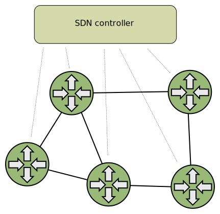

# Xcluster/ovl - ovs

Tests and experiments with [Open vSwitch](https://www.openvswitch.org/) (OVS).
OVS is used in the xcluster VMs, *not on the host* as a VM-VM
network (as the image on [www.openvswitch.org](https://www.openvswitch.org/)
shows).

OVS is an [OpenFlow](https://en.wikipedia.org/wiki/OpenFlow) enabled
virtual switch. It can operate in the Linux kernel or in user-space
(and use for instance DPDK to get traffic) and some smart-nics offers
[OVS HW offload](https://docs.nvidia.com/networking/display/MLNXOFEDv471001/OVS+Offload+Using+ASAP2+Direct).


The figure shows a common setup. The `veth` pair *may* be omitted and
an "internal" OVS port may be injected in the PODs, but an [old bug](
https://mail.openvswitch.org/pipermail/ovs-discuss/2015-July/038205.html)
makes naming of the interface inside the POD impossible.
The name "POD" is used even though K8s is not used, please see
[ovl/netns](../netns).


## Build

Prerequisite; autoconf and libtool installed. For documentation also
`sphinx-build` (sudo apt install python3-sphinx).

```
# Built in $GOPATH/src/github.com/openvswitch/ovs by default
./ovs.sh build   # Will build with XDP support if available
# Or;
./ovs.sh build --dest=/tmp  # Build in /tmp/ovs
```

Now `ovs` should be installed in "SYSD";
```
eval $(./ovs.sh env | grep SYSD)
ls $SYSD/usr/local/bin/
```

The `ovs` man-pages have also been built;
```
./ovs.sh man     # List ovs man-pages
./ovs.sh man ovs-vsctl
```

### Build with XDP support

See [afxdp doc](https://docs.openvswitch.org/en/latest/intro/install/afxdp/).

You must first build `libbpf` in [ovl/xdp](../xdp). This will in
turn require a locally built Linux kernel;

```
cdo xdp
./xdp.sh libbpf_build
cdo ovs
./ovs.sh build
```


## Basic operation

The most described usage in examples and tutorials is to use OVS as a
Linux bridge replacement. Which one is best [depends on the use-case](
https://www.fiber-optic-transceiver-module.com/ovs-vs-linux-bridge-who-is-the-winner.html).
(it would be interresting to know if HW offload can be used in this case)

Example with a Linux bridge;
```
./ovs.sh test start > $log
# On vm-001;
ip link add name br0 type bridge
ip link set up dev br0
ip addr add 172.16.1.0/24 dev br0
ip link set dev vm-001-ns01 master br0
ping 172.16.1.1
```

The same with an OVS bridge;
```
./ovs.sh test start > $log
# On vm-001;
ovs-vsctl add-br br0
ip link set up dev br0
ip addr add 172.16.1.0/24 dev br0
ovs-vsctl add-port br0 vm-001-ns01
ping 172.16.1.1
```

In both cases inter-node connection can be done by adding a physical
interface (e.g eth1) to the bridge. OVS does however offers other options,
e.g with VXLAN.

Automatic test;
```
./ovs.sh test L2 > $log
```


## Basic OpenFlow

Create a bridge without L2 connectivity;
```
./ovs.sh test start > $log
# On vm-001;
ovs-vsctl add-br br0 -- set-fail-mode br0 secure
ip link set up dev br0
ip addr add 172.16.1.0/24 dev br0
ovs-vsctl add-port br0 vm-001-ns01
ping 172.16.1.1        # Doesn't work!
```

Now we have an OpenFlow bridge without any flows, so it will drop
everything. Add some flows;

```
ovs-ofctl add-flow br0 in_port=br0,actions=output:vm-001-ns01
ovs-ofctl add-flow br0 in_port=vm-001-ns01,actions=output:br0
ping 172.16.1.1        # Works!
ovs-ofctl dump-flows br0
```

Automatic test;
```
./ovs.sh test basic_flow > $log
wireshark /tmp/vm-002-vm-002-ns02.pcap &
```


## Load-balancing

To load-balance between ports a "group" is used. The test script
`ovs_test` is used for some tedious configurations. Check it to see how
it's done.

```
xcluster_NPODS=2 ./ovs.sh test --nvm=1 start > $log
# On vm-001;
# Use the test script to setup the bridge
ovs_test ofbridge --configure --mac=0:0:0:0:0:1
ifconfig br0  # Note NOARP and the MAC

# Attach the veth's from the PODs and set the same MAC
ovs_test attach_veth --noarp --mac=0:0:0:0:0:1
ovs-vsctl show
```

Load-balancing uses a "group". It is empty from start but we will add
some "buckets" that contains "actions", for instance an outout port.

```
ovs-ofctl add-group br0 group_id=0,type=select,selection_method=hash
ovs-ofctl dump-groups br0

ovs-ofctl insert-buckets br0 \
  group_id=0,command_bucket_id=last,bucket=bucket_id:1,weight=1,actions=output:vm-001-ns01
ovs-ofctl insert-buckets br0 \
  group_id=0,command_bucket_id=last,bucket=bucket_id:2,weight=1,actions=output:vm-001-ns02
ovs-ofctl dump-groups br0

# Add a flow that directs packet on br0 to our new group
ovs-ofctl add-flow br0 in_port=br0,actions=group:0
```

The load-balancing is done. Packets entering the bridge `br0` will be
load-balanced between the 2 PODs. But there is more to be done, we
have no VIP address and no return-flow from the PODs.

```
ovs_test add_vip 10.0.0.0   # Add VIP addresses to all PODs
ip netns exec vm-001-ns01 ip addr show eth0
ip ro add 10.0.0.0/32 dev br0
ip -6 ro add 1000::1:10.0.0.0/128 dev br0
ovs-ofctl add-flow br0 in_port=vm-001-ns01,actions=output:br0
ovs-ofctl add-flow br0 in_port=vm-001-ns02,actions=output:br0
```

Now everything is in place. Start `mconnect` servers in the PODs and
test.

```
ovs_test tcase_mconnect_server > /dev/null
mconnect -address [1000::1:10.0.0.0]:5001 -nconn 100
mconnect -address 10.0.0.0:5001 -nconn 100
```


Automatic test;
```
./ovs.sh test load_balancing > $log
```

### About MAC addresses

Unless you start a "normal" bridge that have L2-learning (as a HW
switch) the OvS bridge doesn't care about MAC addresses, but Linux
does! If a packet enters via OvS (and veth) with a MAC that doesn't
match the interface then Linux will discard the packet.

For load-balancing that means that all targets must have the same MAC
address.

You may have noticed that in these examples *all* interfaces are setup
with the same MAC `0:0:0:0:0:1`. That is just a convenient way of
making Linux accept all packets without too much configuration.


## SDN controller

OpenFlow switches are normally used in Software Defined Networks
[SDN](https://en.wikipedia.org/wiki/Software-defined_networking). In
SDN the switches are managed by an `SDN controller`. There are
[many available](https://en.wikipedia.org/wiki/List_of_SDN_controller_software)
and `ovs` includes the `ovs-testcontroller`.




ovs-testcontroller example;
```
./ovs.sh test start > $log
# On vm-001;
ovs_test ofbridge
ovs_test attach_veth
ovs-vsctl set-controller br0 ptcp:  # listen on tcp (passive?)
ovs-vsctl show
ovs-ofctl dump-flows tcp:127.0.0.1

netns_test exec vm-001-ns01 -- ping -c1 -W1 172.16.1.2
ovs-testcontroller tcp:127.0.0.1 --wildcards
netns_test exec vm-001-ns01 -- ping -c1 -W1 172.16.1.2
ovs-ofctl show tcp:127.0.0.1
ovs-ofctl dump-flows tcp:127.0.0.1
```

### SDN controller on your host

If you plan to test an advanced SDN controller it is a good idea to
run the controller on your host rather than try to squeeze it into the
rather limited `xcluster` VMs. Use the xcluster maintenance network
(192.168.0.0/24) as control network (will not work with `xcluster` in
main netns with user-space networking).

```
# On host
./ovs.sh test start > $log
eval $(./ovs.sh env | grep SYSD)
alias ovs-testcontroller=$SYSD/usr/local/bin/ovs-testcontroller
alias ovs-ofctl=$SYSD/usr/local/bin/ovs-ofctl
# On vm-001
ovs_test ofbridge
ovs_test attach_veth
ovs-vsctl set-controller br0 ptcp:
# Back on host
ovs-ofctl show tcp:192.168.0.1
ovs-testcontroller tcp:192.168.0.1 --wildcards \
  --unixctl=/tmp/$USER/ovs-testcontroller.ctl
# On vm-001, test with ping as before
```


### SDN controller in docker or main netns

If you want to control OvS in `xcluster` VMs from docker or your main
netns you must create your `xcluster` netns with;

```
$ xc nsadd_docker 1   # (or another index)
xcluster.sh: Xcluster netns; 172.17.0.51/16
...
```

Then in docker containers or main netns set a route to the `xcluster`
maintenance network. Example;

```
sudo ip route add 192.168.0.0/24 via 172.17.0.51
```

The address is of the `host1` interface in the xcluster netns. It is
printed when you created it.

Then when you start `xcluster` (in the xcluster netns) set the
`xcluster_DOCKER_NET` variable;

```
export xcluster_DOCKER_NET=172.17.0.0/16
./ovs.sh test start > $log
```

You should now be able to ping any `xcluster` VM from main netns or
from a docker container;

```
ping 192.168.0.1
```


### The Faucet SDN controller in docker

The [Faucet](https://github.com/faucetsdn/faucet) can be installed in
docker.

```
docker pull faucet/faucet:latest
```


## Other Info

In no particular order or usefulness.

* https://www.openvswitch.org/
* https://github.com/openvswitch/ovs/
* https://kumul.us/switches-ovs-vs-linux-bridge-simplicity-rules/
* https://www.plixer.com/blog/openflow-vs-netflow/
* https://www.linuxtechi.com/install-use-openvswitch-kvm-centos-7-rhel-7/
* https://arthurchiao.art/blog/ovs-deep-dive-6-internal-port/
* https://arthurchiao.art/blog/ovs-deep-dive-1-vswitchd/
* http://yuba.stanford.edu/~casado/of-sw.html
* https://en.wikipedia.org/wiki/List_of_SDN_controller_software


```
./ovs.sh test start > $log
# On a VM;
ovs-vsctl -V
grep -v JSON /etc/openvswitch/conf.db | jq
ovs-vsctl add-br br0
ovs-appctl dpctl/show
ovs-appctl dpif/show-dp-features br0
#ovs-vsctl add-br br1 -- set Bridge br1 datapath_type=netdev
ovs-vsctl add-port br0 eth1
ovs-vsctl add-port br0 vlan10 tag=10 -- set Interface vlan10 type=internal
i=$(hostname | cut -d- -f2 | sed -re 's,^0+,,')
ip link set up dev vlan10
ip addr add 3000::$i/120 dev vlan10
ping -c1 3000::$i
```
