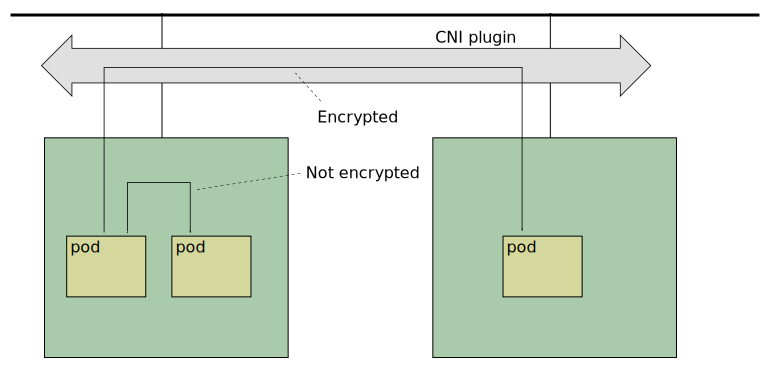

# Xcluster ovl - podsec

Encrypts all pod-to-pod traffic between pods on different nodes in a
K8s cluster. Traffic between pods on the same node is not encrypted.



## IPSec

There is **no** IKE, e.g StrongSwan, in this setup. Encrypted ESP
tunnels are setup using `ip xfrm`.

### Usage

The `alpine` pod can be used as an example.

```
xc mkcdrom podsec private-reg; xc start
# On cluster;
kubectl apply -f /etc/kubernetes/alpine.yaml
kubectl get pods -o wide
kubectl exec -it <pod> sh
# In the alpine pod (replace 11.0.3.2 with a valid pod alpine address);
nc 11.0.3.2 5001 < /dev/null
# At some other place;
tcpdump -ni eth1 esp
```

Key rotation is missing. The initial key is used forever.


## WireGuard

Using [WireGuard]().

### Usage

```
SETUP=wireguard xc mkcdrom wireguard podsec private-reg; xc start
# Test as for IPSec
```

Configuration is much harder than with IPSec since each client is
identified with it's public key so no common key can be used.
