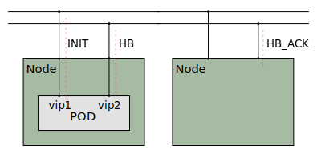
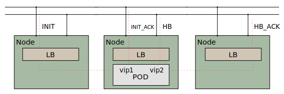
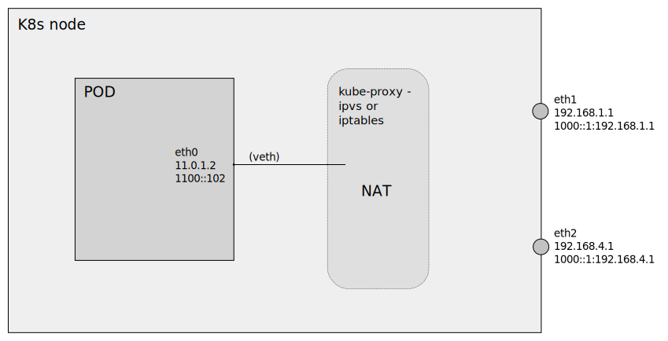

# Xcluster/ovl - sctp

Test and experiments with the
[SCTP](https://en.wikipedia.org/wiki/Stream_Control_Transmission_Protocol)
protocol ([rfc4960](https://datatracker.ietf.org/doc/html/rfc4960)).

There are user-space implementations of SCTP, for instance
[usrsctp](https://github.com/sctplab/usrsctp), but we focus mainly on
Linux kernel SCTP (lksctp).

The `go` language does not support sctp in standard packages. There
are 3rd party implementations that uses
[lksctp](https://github.com/ishidawataru/sctp) as well as in
[user-space](https://github.com/pion/sctp). But for now we stick to
`C` code.

All examples and tests are using multihoming because that's where the
problems are. The [ovl/network-topology](../network-topology) is used
with the `dual-path` setup;


## Basic example

```
./sctp.sh nfqlb_download
./sctp.sh test start > $log
# On vm-001
sctpt server --log 6 --addr 192.168.1.1,192.168.4.1
# On vm-221
sctpt client --log 6 --addr 192.168.1.1,192.168.4.1 --laddr 192.168.2.221,192.168.6.221
# (typed text will be echoed by the server)
# Type ^D to quit
```

The `sctpt` test program is used to setup a multihomed sctp
"association" ([trace](captures/basic.pcap)).


The multihoming addresses are passed in the `INIT` and `INIT_ACK`
messages. This makes NAT (and load-balancing)
[very complicated](https://datatracker.ietf.org/doc/html/rfc3257#section-4).

You can trace with `tcpdump` on any VM and try to disable the primary
path and watch the failover to the secondary path;

```
# On vm-201
iptables -A FORWARD -p sctp -j DROP
# (send something from the client)
iptables -D FORWARD 1
```

UDP encapsulation with load-balancing;
```
./sctp.sh nfqlb_download
xcluster_UDP_ENCAP=9899 xcluster_NETNS=yes ./sctp.sh test --no-stop nfqlb > $log
# On vm-221
sysctl -w net.sctp.encap_port=9899
sysctl -w net.sctp.udp_port=9899
sctpt client --log 6 --addr 10.0.0.1,1000::81 --laddr 192.168.2.221,1000::1:192.168.6.221
# On vm 201
iptables -A FORWARD -p udp --sport 9899 -j DROP
iptables -D FORWARD 1
```


## Virtual IP (VIP) and cluster

If we use VIP addresses and ECMP in a cluster we got a problem;




The HB_ACK has different addresses (both source and dest) and will
probably be ecmp'ed to another node.

We can add a load-balancer to handle the situation;



But a problem is that the LB handling the HB_ACK must select the same
POD as the INIT message. The addresses are different *but the ports are the same*! Note that there is no NAT, direct server return (DSR) is used.

So a possible approach is to let the load-balancers *hash on ports only*.


## Kubernetes

K8s supports services with "protocol: SCTP". But multihoming can't be
used because of NAT.



Assuming `externalTrafficPolicy: Local` this happens;

1. INIT from the client arrives on eth1 with load-balancer-IP (VIP) 10.0.0.72. The INIT chunk contains the multihoming addresses of the client (192.168.2.221, 192.168.6.221).

2. The VIP address is translated to the podIP (11.0.1.2) by iptables or ipvs (configured by kube-proxy).

3. The server (in the POD) sends a INIT_ACK (without addresses) and the association is succesful.

4. The server tries to send HB to the client's multihoming addresses. But the source is NAT'ed to the node address.

5. The client responds with ABORT since the source is not valid.

6. The ABORT messages arrives to the node (some via eth2) but are *not* forwarded to the POD. This I can't explain.


## References

* `man 7 sctp`
* https://github.com/sctp/lksctp-tools
* [usrsctp](https://github.com/sctplab/usrsctp)
* https://github.com/ishidawataru/sctp
* https://github.com/pion/sctp/
* https://www.ietf.org/staging/draft-ietf-tsvwg-natsupp-21-to-be-None.html
* https://datatracker.ietf.org/doc/html/rfc3257
