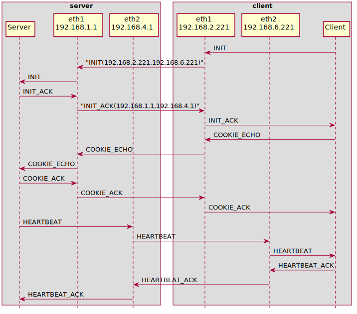

# Xcluster/ovl - sctp

Test and experiments with the
[SCTP](https://en.wikipedia.org/wiki/Stream_Control_Transmission_Protocol)
protocol ([rfc4960](https://datatracker.ietf.org/doc/html/rfc4960)).

There are user-space implementations of SCTP, for instance
[usrsctp](https://github.com/sctplab/usrsctp), but we focus mainly on
Linux kernel SCTP (lksctp).

The `go` language does not support sctp in standard packages. There
are 3rd party implementations that uses
[lksctp](https://github.com/ishidawataru/sctp) as well as in
[user-space](https://github.com/pion/sctp). But for now we stick to
`C` code.

All examples and tests are using multihoming because that's where the
problems are. The [ovl/network-topology](../network-topology) is used
with the `dual-path` setup;


## Basic example

```
./sctp.sh nfqlb_download
./sctp.sh test start > $log
# On vm-001
sctpt server --log 6 --addr 192.168.1.1,192.168.4.1
# On vm-221
sctpt client --log 6 --addr 192.168.1.1,192.168.4.1 --laddr 192.168.2.221,192.168.6.221
# (typed text will be echoed by the server)
# Type ^D to quit
```

The `sctpt` test program is used to setup a multihomed sctp
"association" ([trace](captures/basic.pcap)).



The multihoming addresses are passed in the `INIT` and `INIT_ACK`
messages. This makes NAT (and load-balancing)
[very complicated](https://datatracker.ietf.org/doc/html/rfc3257#section-4).

You can trace with `tcpdump` on any VM and try to disable the primary
path and watch the failover to the secondary path;

```
# On vm-201
iptables -A FORWARD -p sctp -j DROP
# (send something from the client)
iptables -D FORWARD 1
```


## References

* `man 7 sctp`
* https://github.com/sctp/lksctp-tools
* [usrsctp](https://github.com/sctplab/usrsctp)
* https://github.com/ishidawataru/sctp
* https://github.com/pion/sctp/
* https://www.ietf.org/staging/draft-ietf-tsvwg-natsupp-21-to-be-None.html
* https://datatracker.ietf.org/doc/html/rfc3257
