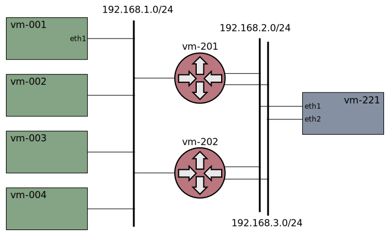

# Xcluster/ovl - sctp

Test and experiments with the
[SCTP](https://en.wikipedia.org/wiki/Stream_Control_Transmission_Protocol)
protocol ([rfc4960](https://datatracker.ietf.org/doc/html/rfc4960)).

SCTP is supported by the Linux kernel (lksctp), and there are
user-space implementations for instance [usrsctp](https://github.com/sctplab/usrsctp).

All examples and tests in this ovl are using multihoming because
that's where the problems are. The `dual-path`
[network-topology](../network-topology) is often used;


Virtual IPs (VIP) and load-balancing with multihoming is a challenge. If
simple load-balancing like ECMP that hashes on addresses (and ports)
is used the primary and secondary path may be load-balanced to
different targets.


SCTP load-balancing in the [nfqueue-loadbalancer](https://github.com/Nordix/nfqueue-loadbalancer/blob/master/sctp.md)
overcome the problem by hashing on ports only.


### Basic example

The [nfqueue-loadbalancer](https://github.com/Nordix/nfqueue-loadbalancer)
is used to build the `sctpt` test program so it must be
downloaded but load-balancing is not used in this example.

Manual test;
```
./sctp.sh nfqlb_download
./sctp.sh test start > $log
# On vm-001
sctpt server --log 6 --addr 192.168.1.1,192.168.4.1
# On vm-221
sctpt client --log 6 --addr 192.168.1.1,192.168.4.1 --laddr 192.168.2.221,192.168.6.221
# (typed text will be echoed by the server)
# Type ^D to quit
```

The `sctpt` test program is used to setup a multihomed sctp
"association" ([trace](captures/basic.pcap)).


The multihoming addresses are passed in the `INIT` and `INIT_ACK`
messages.

You can trace with `tcpdump` on any VM and try to disable the primary
path and watch the failover to the secondary path;

```
# On vm-201
iptables -A FORWARD -p sctp -j DROP
# (send something from the client)
iptables -D FORWARD 1
```

### Load-balancing example

The [nfqueue-loadbalancer](https://github.com/Nordix/nfqueue-loadbalancer)
can be used for sctp load balancing and UDP encapsulation can be used.

UDP encapsulation with load-balancing;
```
./sctp.sh nfqlb_download
xcluster_UDP_ENCAP=9899 xcluster_NETNS=yes ./sctp.sh test --no-stop nfqlb > $log
# On vm-221
sysctl -w net.sctp.encap_port=9899
sysctl -w net.sctp.udp_port=9899
sctpt client --log 6 --addr 10.0.0.1,1000::81 --laddr 192.168.2.221,1000::1:192.168.6.221
# On vm 201
iptables -A FORWARD -p udp --sport 9899 -j DROP
iptables -D FORWARD 1
```


## The sctpt test program

The `sctpt` test program uses Linux kernel SCTP and is written in `C`.
The `go` language does not support sctp in standard packages. There
are 3rd party implementations that uses
[lksctp](https://github.com/ishidawataru/sctp) as well as in
[user-space](https://github.com/pion/sctp).


Build;
```
./sctp.sh nfqlb_download
make -C src
alias sctpt=/tmp/uablrek/sctpt/sctpt/sctpt
sctpt # (brief help printout)
```

### Client/server

Start server;
```
sctpt server -h  # Help printout
sctpt server --log=7 --addr=127.0.0.1,127.0.0.2
```

Start client;
```
sctpt client -h  # Help printout
sctpt client --log=7 --addr=127.0.0.1,127.0.0.2 --laddr=127.0.1.1,127.0.1.2
```

The local addresses on the client shall always be specified for
multihoming using the `--laddr` option.


### Ctraffic

This mode is intended for testing failovers and mimics the
[ctraffic](https://github.com/Nordix/ctraffic) program. The same
server as for `sctpt client` is used. 

Statistics are continuously written to shared memory and can be viewed
in real time.

```
sctpt stats -h     # Help printout
sctpt ctraffic -h  # Help printout
sctpt stats --interval=50 init
sctpt ctraffic --addr=127.0.0.1,127.0.0.2 --laddr=127.0.1.1,127.0.1.2 --rate=10
sctpt stats show
watch /tmp/uablrek/sctpt/sctpt/sctpt stats show
```


## Kubernetes

To test with a "vanilla" K8s setup with only one traffic interface per
node the default `xcluster` network is setup with an additional tester network;




K8s supports services with "protocol: SCTP". The normal K8s
load-balancing, `kube-proxy` (both proxy-modes), uses NAT which
basically makes multihoming impossible, or at least
[very complicated](https://datatracker.ietf.org/doc/html/rfc3257#section-4).


Multihoming to a single-homed K8s POD (fails);
```
./sctp.sh test start_k8s > $log
# On vm-002 (incoming traffic arrives here) or on vm-201 (router)
tcpdump -ni eth1 sctp
# On vm-221
sctpt client --addr=10.0.0.72 --port=7002 --laddr=192.168.2.221,192.168.3.221
# Or;
sctpt client --addr=1000::72 --port=7002 --laddr=1000::1:192.168.2.221,1000::1:192.168.3.221
```


Assuming `externalTrafficPolicy: Local` this happens;

1. INIT from the client arrives on eth1 with load-balancer-IP (VIP)
   10.0.0.72. The INIT chunk contains the multihoming addresses of the
   client (192.168.2.221, 192.168.3.221).

2. The VIP address is translated to the podIP (e.g 11.0.2.2) by iptables
   or ipvs (configured by kube-proxy).

3. The server (in the POD) sends a INIT_ACK (without addresses) and
   the association is succesful.

4. The server tries to send HB to the client's multihoming
   addresses. But the source is NAT'ed to the node address.

5. The client responds with ABORT since the source is not valid.

6. The ABORT messages arrives to the node with the secondary address
   (192.168.3.221) as source but are *not* forwarded to the POD,
   proably because there is no connection in the Linux `conntrack`
   which is used for NAT.


### Kpng to the rescue?

What we would like to have is a load-balancer that selects the same
target for both the primary and secondary path whereever the packets arrive;


The K8s `kube-proxy` will not be extended to handle this but an option
may be to write a [custom proxier](https://kubernetes.io/blog/2021/10/18/use-kpng-to-write-specialized-kube-proxiers/)
using [kpng](https://github.com/kubernetes-sigs/kpng).


## References

* `man 7 sctp`
* https://github.com/sctp/lksctp-tools
* [usrsctp](https://github.com/sctplab/usrsctp)
* https://github.com/ishidawataru/sctp
* https://github.com/pion/sctp/
* https://www.ietf.org/staging/draft-ietf-tsvwg-natsupp-21-to-be-None.html
* https://datatracker.ietf.org/doc/html/rfc3257
