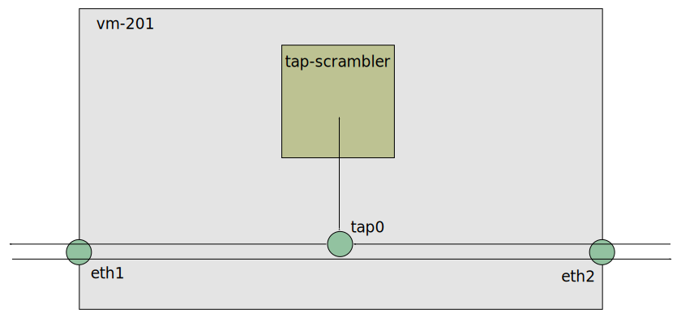
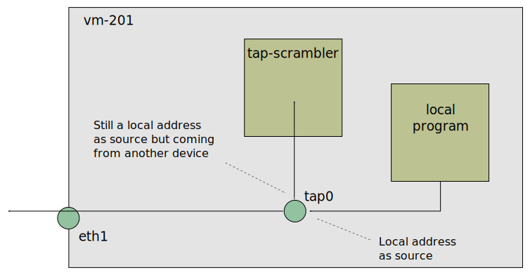

# Xcluster - ovl/tap-scrambler

A network test-tool built on a Linux `tap` device.

This is a functional test tool. It is not for performance testing.



The idea is that incoming traffic is directed to a `tap` device and
furhter to the `tap-scrambler` process. The `tap-scrambler` does bad
things for test purposes and passes on the traffic.

In the image only traffic in one direction passes the
`tap-scrambler`. This is assumed to be the normal operation.


## Usage

By default the `tap-scrambler` is started on the
[evil_tester](https://github.com/Nordix/xcluster/tree/master/ovl/network-topology#evil-tester)
(vm-222).

Simple forwarding;
```
./tap-scrambler.sh test start > $log
# On vm-222 (evil-tester)
tap-scrambler fwd --tap=tap2
# On vm-221
ping -c1 -s 2000 192.168.1.1
ping -c1 -M do -s 2000 1000::1:192.168.1.1
```

Reverse fragments;
```
./tap-scrambler.sh test start > $log
# On vm-222 (evil-tester)
tap-scrambler fragrev --tap=tap2
# On vm-001
ethtool -K eth1 gro off gso off tso off
tcpdump -ni eth1
# On vm-221
ping -c1 -s 2000 192.168.1.1
ping -c1 -s 2000 1000::1:192.168.1.1
```

Ipv4 fragments are re-ordered back by the kernel for some reason. So
fragments leaves `tap2` in reverse order but are sent in correct orded
over `eth1`. This is not what we want and the (faulty) order is
preserved for ipv6 packets. Here are some attempts to stop the
fragments to be re-ordered;

```
ethtool -K eth1 gro off gso off tso off
ethtool -K eth2 gro off gso off tso off
iptables -t nat -F
iptables -t raw -A PREROUTING -i tap2 -j NOTRACK
```

## Building and extending

```
gcc -Wall -o tap-scrambler src/*
```

There is no configuration language or something similar for
`tap-scrambler`. That is intentional. When thinking about how to let
users customize tests I realized that I have no idea what people might
want to test. Instead `tap-scrambler` is really simple to extend. Just
copy `cmdFwd.c` and write your own test in C.

```
# A new traffic-loss test;
cp src/cmdFwd.c src/cmdDrop.c
vi src/cmdDrop.c
```

No update in any central code is needed. The new function will be
included automatically by the "constructor";

```c
__attribute__ ((__constructor__)) static void addCmdDrop(void) {
	addCmd("drop", cmdDrop);
}
```


## The Martian problem

The figure above shows `tap-scrambler` in a forwarding machine. You
might want to use `tap-scrambler` locally and direct local traffic to
it, but there is a problem...



Packets from a local program are sent with a local address as
source. Packets are routed to `tap-scrambler` which will not alter the
addresses and send the packet back. But the returned packet will have
a local address as source but coming from a non-local source. The
kernel will discard it as beeing a
[martian](https://en.wikipedia.org/wiki/Martian_packet).


## Links

* https://github.com/gregnietsky/simpletun
* https://backreference.org/2010/03/26/tuntap-interface-tutorial/

