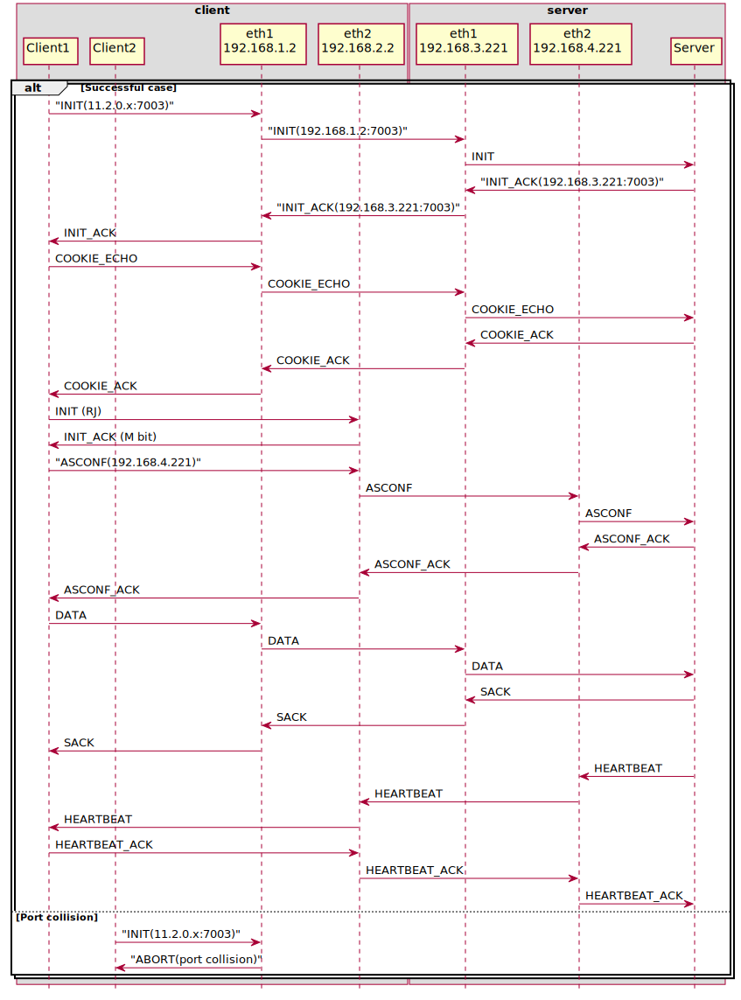

# Xcluster/ovl - usrsctp

Test and experiments with userspace SCTP stack and linux SCTP conntrack module

## Timer based SCTP conntrack state machine
Implementation proposal can be found here: https://github.com/sriramy/nf/compare/master...sctp_ct

With this patchset, the tests should be edited to run with the following check "check_discard_init"
```
	otc 2 "check_discard_init"
```

## Single homed endpoint tests in a k8s pod (behind NAT ofc)
Server tests
```
./usrsctp.sh test k8s_server
./usrsctp.sh test k8s_server_calico
```
Client tests
```
./usrsctp.sh test k8s_client
./usrsctp.sh test k8s_client_calico
```

## Single/multi homed endpoint tests with router as NAT/middlebox
Client tests
```
./usrsctp.sh test client
./usrsctp.sh test client_mh
```

### Test environment


## Multihoming support behind NAT
The following IETF proposal has since been rejected, but some tests will be added as an example
https://datatracker.ietf.org/doc/draft-porfiri-tsvwg-sctp-natsupp/

### SCTP conntrack state machine based on timer, and REJECT targets
Implementation proposal can be found here: https://github.com/sriramy/nf/compare/master...sctp_ct_nat

### Test environment


### Multiple clients behind NAT

