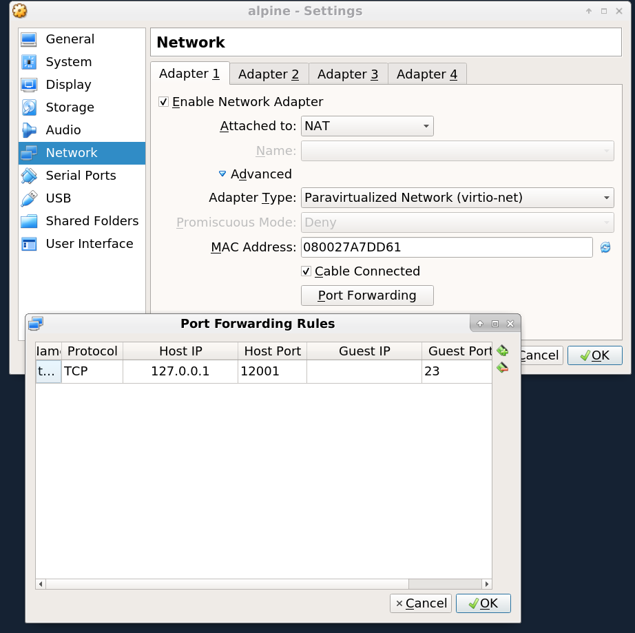

# Xcluster ovl - virtualbox

Describes howto create a [VirtualBox](https://www.virtualbox.org/) image.

**NOTE**: The `xcluster` cluster functions can't really be used with
VirtualBox. However the ovl function can be used to create usable images.

## Kernel re-build

`Xcluster` uses [virtio](https://www.linux-kvm.org/page/Virtio)
disks. They show up as for instance `/dev/vda` in Linux. VirtualBox
does not support virtio disks so we must configure and re-build the
`xcluster` kernel to support ATA disks. Also `xcluster` uses the
serial link as console, VirtualBox uses a virtual screen.

```
./vbox.sh kernel_build [--menuconfig]
```


## Hd image

Set `$__image` so no existing image is overwritten.

```
export __image=/tmp/$USER/vbox.qcow2
./vbox.sh mkimage [ovls...]
```

Test with kvm;
```
kvm -hda $__image
```

### Alpine Linux

The `xcluster` system start is used, not
[OpenRC](https://wiki.alpinelinux.org/wiki/Alpine_Linux_Init_System)
which is normally used in Alpine Linux.

```
export __image=/tmp/$USER/vbox.qcow2
./vbox.sh mkimage --alpine=alpine:latest [ovls...]
```

Extended Alpine example;
```
docker build -t alpine-xcluster:latest ./alpine
./vbox.sh mkimage --alpine=alpine-xcluster:latest
```


## Convert to vdi format

```
export VBOXDIR=(some dir)
qemu-img convert -f qcow2 $__image -O vdi $VBOXDIR/xcluster.vdi
```

## VirtualBox network setup

All networks *must* be `virtio-net`.The first network should be a
`NAT` network. You may add port forwarding to port 23 (telnet);




## Examples

Use DHCP on eth0 and eth1;
```
xcluster_DHCP_IFACES="eth0 eth1" ./vbox.sh mkimage env
```

Use the default xcluster network setup;
```
# (eth1 should be a VBox "Internal" network)
./vbox.sh mkimage iptools xnet
qemu-img convert -f qcow2 $__image -O vdi $VBOXDIR/xcluster.vdi
# The image should be "immutable" so it can be used by many VMs
VBoxManage modifymedium disk $VBOXDIR/xcluster.vdi --type immutable
```

A Kubernetes image;
```
# KUBERNETESD points to an unpacked k8s server release
export KUBERNETESD=$HOME/tmp/kubernetes/kubernetes-v1.20.4/server/bin
./vbox.sh mkimage --size=8G xnet etcd iptools crio kubernetes mconnect images k8s-cni-bridge
qemu-img convert -f qcow2 $__image -O vdi $VBOXDIR/k8s.vdi
VBoxManage modifymedium disk $VBOXDIR/k8s.vdi --type immutable
# Memory ~2G on vm-001 (master) and ~1G on others (workers)
```

An Alpine Linux image with gobgp;
```
docker build -t alpine-xcluster:latest ./alpine
docker build -t alpine-quagga:latest -f alpine/Dockerfile.quagga ./alpine
SETUP=gobgp-base xcluster_DHCP_IFACES="eth0 eth1" \
  ./vbox.sh mkimage --alpine=alpine-quagga:latest env gobgp
qemu-img convert -f qcow2 $__image -O vdi $VBOXDIR/gobgp.vdi
```

Quick **and destructive** image replace for development;
```
./vbox.sh replace_disk vm-001 vm-002
```
