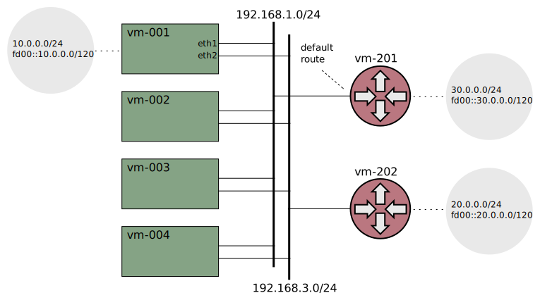

# Xcluster/ovl - vrf

Virtual Routing and Forwarding (VRF)

* [linux/Documentation/networking/vrf.rst](
   https://docs.kernel.org/networking/vrf.html)

* https://unix.stackexchange.com/questions/739196/how-can-loopback-addresses-be-assiged-in-a-linux-vrf

This ovl was primarily created for a demo at Mar 2023. So, please
check the `demo/` dir. Demo network setup;

